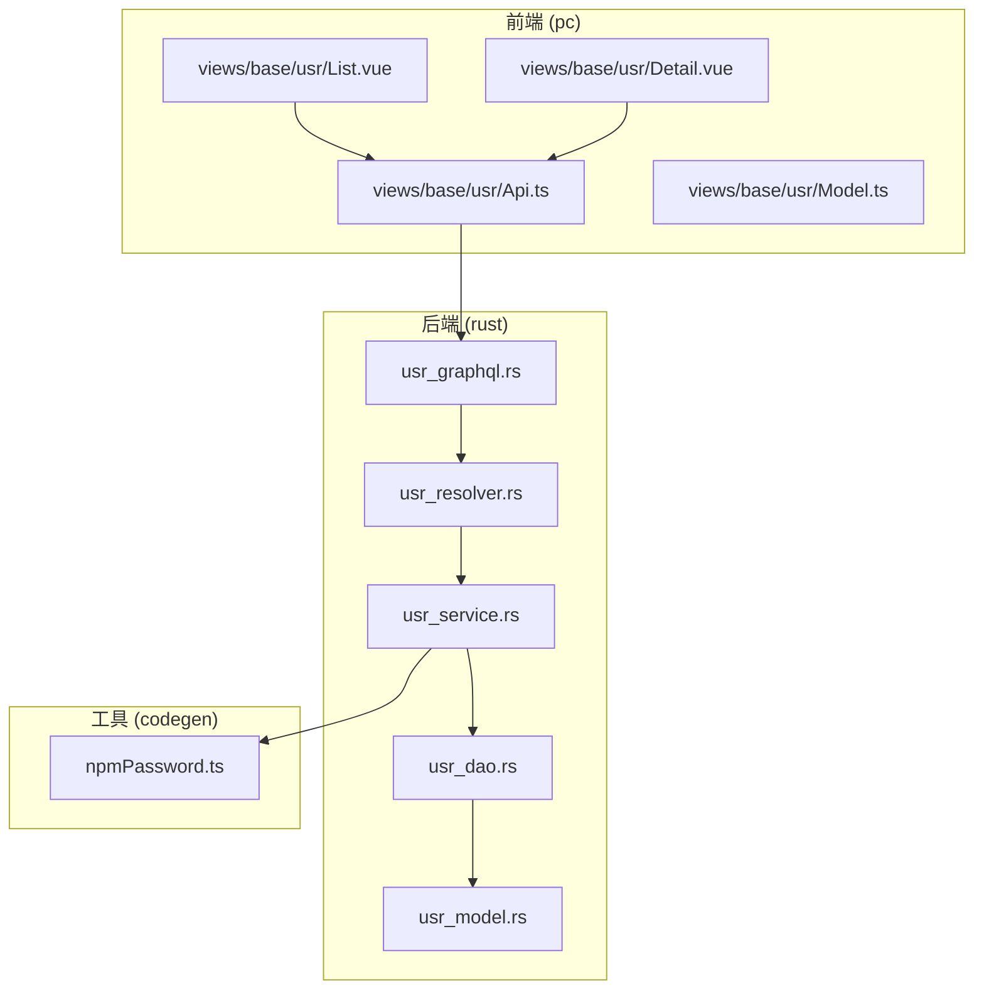
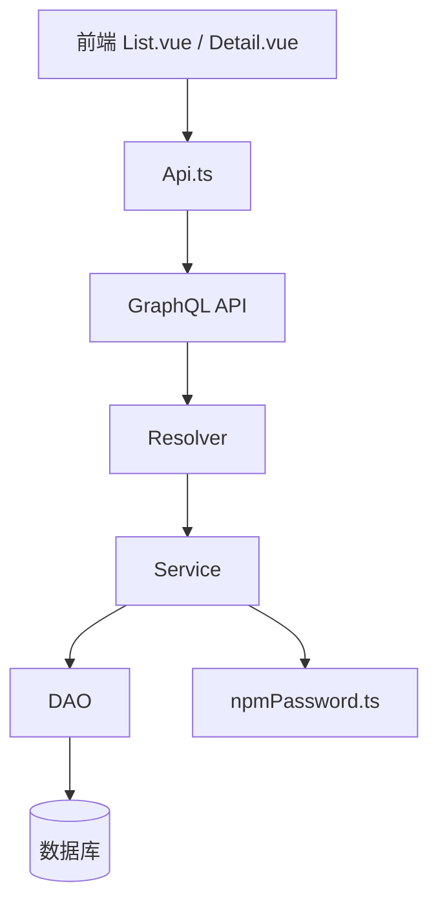
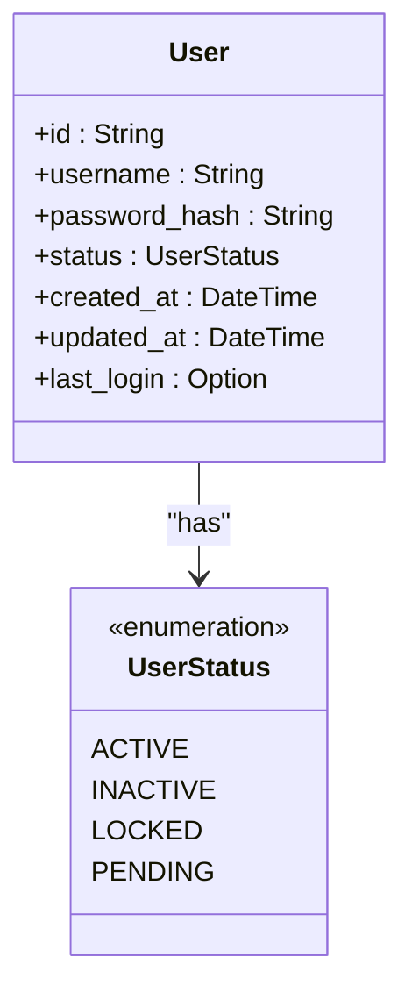
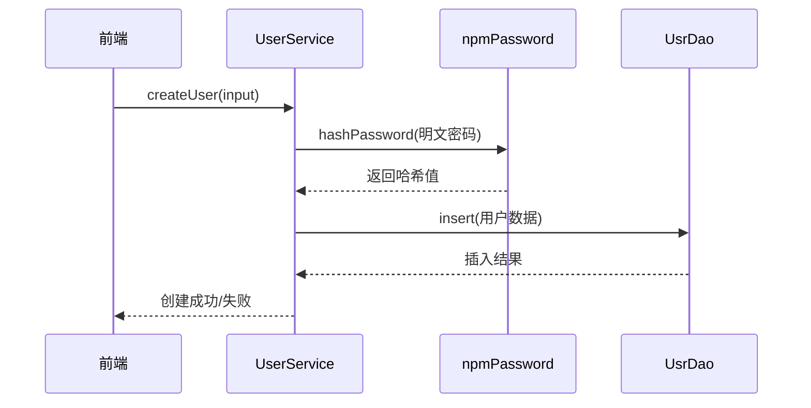
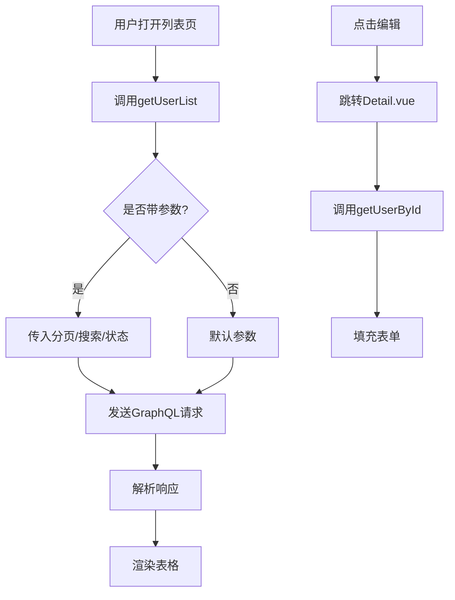
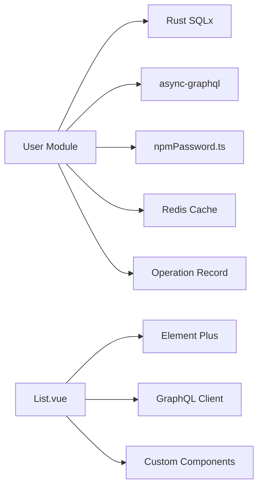

# 用户管理

**本文档引用的文件**  
- [usr_model.rs](https://github.com/sail-sail/nest/blob/main/rust/generated/base/usr/usr_model.rs)
- [usr_dao.rs](https://github.com/sail-sail/nest/blob/main/rust/generated/base/usr/usr_dao.rs)
- [usr_service.rs](https://github.com/sail-sail/nest/blob/main/rust/generated/base/usr/usr_service.rs)
- [usr_resolver.rs](https://github.com/sail-sail/nest/blob/main/rust/generated/base/usr/usr_resolver.rs)
- [usr_graphql.rs](https://github.com/sail-sail/nest/blob/main/rust/generated/base/usr/usr_graphql.rs)
- [npmPassword.ts](https://github.com/sail-sail/nest/blob/main/codegen/src/util/npmPassword.ts)
- [List.vue](https://github.com/sail-sail/nest/blob/main/pc/src/views/base/usr/List.vue)
- [Detail.vue](https://github.com/sail-sail/nest/blob/main/pc/src/views/base/usr/Detail.vue)
- [Api.ts](https://github.com/sail-sail/nest/blob/main/pc/src/views/base/usr/Api.ts)
- [Model.ts](https://github.com/sail-sail/nest/blob/main/pc/src/views/base/usr/Model.ts)

## 目录
1. [简介](#简介)
2. [项目结构](#项目结构)
3. [核心组件](#核心组件)
4. [架构概览](#架构概览)
5. [详细组件分析](#详细组件分析)
6. [依赖分析](#依赖分析)
7. [性能考虑](#性能考虑)
8. [故障排除指南](#故障排除指南)
9. [结论](#结论)

## 简介
本文档详细描述了用户管理模块的设计与实现，涵盖用户实体模型、数据访问层、业务服务逻辑以及GraphQL接口暴露机制。重点解析用户模型字段定义、密码加密策略、状态管理机制，并通过前后端交互流程展示增删改查操作的完整链路。同时说明前端组件如何与后端API通信，以及分页、搜索和状态过滤功能的实现方式。最后提供扩展指南，指导如何添加自定义属性或修改验证规则。

## 项目结构
用户管理模块在系统中分布于多个子项目中，主要包括Rust后端服务、TypeScript前端应用及代码生成工具。模块遵循分层架构设计，各层职责清晰。

**图示来源**  
- [List.vue](https://github.com/sail-sail/nest/blob/main/pc/src/views/base/usr/List.vue)
- [Detail.vue](https://github.com/sail-sail/nest/blob/main/pc/src/views/base/usr/Detail.vue)
- [Api.ts](https://github.com/sail-sail/nest/blob/main/pc/src/views/base/usr/Api.ts)
- [usr_model.rs](https://github.com/sail-sail/nest/blob/main/rust/generated/base/usr/usr_model.rs)
- [usr_dao.rs](https://github.com/sail-sail/nest/blob/main/rust/generated/base/usr/usr_dao.rs)
- [usr_service.rs](https://github.com/sail-sail/nest/blob/main/rust/generated/base/usr/usr_service.rs)
- [usr_resolver.rs](https://github.com/sail-sail/nest/blob/main/rust/generated/base/usr/usr_resolver.rs)
- [usr_graphql.rs](https://github.com/sail-sail/nest/blob/main/rust/generated/base/usr/usr_graphql.rs)
- [npmPassword.ts](https://github.com/sail-sail/nest/blob/main/codegen/src/util/npmPassword.ts)

**本节来源**  
- [pc/src/views/base/usr](https://github.com/sail-sail/nest/blob/main/pc/src/views/base/usr)
- [rust/generated/base/usr](https://github.com/sail-sail/nest/blob/main/rust/generated/base/usr)
- [codegen/src/util/npmPassword.ts](https://github.com/sail-sail/nest/blob/main/codegen/src/util/npmPassword.ts)

## 核心组件
用户管理模块由五大核心组件构成：用户模型（Model）、数据访问对象（DAO）、业务服务（Service）、解析器（Resolver）和GraphQL接口定义。这些组件分别位于Rust后端的不同文件中，形成清晰的调用链路。前端通过Api.ts封装请求，由List.vue和Detail.vue实现UI交互。

**本节来源**  
- [usr_model.rs](https://github.com/sail-sail/nest/blob/main/rust/generated/base/usr/usr_model.rs#L1-L50)
- [usr_dao.rs](https://github.com/sail-sail/nest/blob/main/rust/generated/base/usr/usr_dao.rs#L1-L30)
- [usr_service.rs](https://github.com/sail-sail/nest/blob/main/rust/generated/base/usr/usr_service.rs#L1-L40)
- [usr_resolver.rs](https://github.com/sail-sail/nest/blob/main/rust/generated/base/usr/usr_resolver.rs#L1-L35)
- [usr_graphql.rs](https://github.com/sail-sail/nest/blob/main/rust/generated/base/usr/usr_graphql.rs#L1-L25)

## 架构概览
系统采用典型的分层架构，从前端UI到后端持久化层逐层解耦。GraphQL作为统一接口层，由Resolver协调Service完成业务逻辑处理，DAO负责与数据库交互，Model定义数据结构。

**图示来源**  
- [List.vue](https://github.com/sail-sail/nest/blob/main/pc/src/views/base/usr/List.vue#L1-L100)
- [Detail.vue](https://github.com/sail-sail/nest/blob/main/pc/src/views/base/usr/Detail.vue#L1-L100)
- [Api.ts](https://github.com/sail-sail/nest/blob/main/pc/src/views/base/usr/Api.ts#L1-L50)
- [usr_resolver.rs](https://github.com/sail-sail/nest/blob/main/rust/generated/base/usr/usr_resolver.rs#L1-L40)
- [usr_service.rs](https://github.com/sail-sail/nest/blob/main/rust/generated/base/usr/usr_service.rs#L1-L60)
- [usr_dao.rs](https://github.com/sail-sail/nest/blob/main/rust/generated/base/usr/usr_dao.rs#L1-L30)
- [npmPassword.ts](https://github.com/sail-sail/nest/blob/main/codegen/src/util/npmPassword.ts#L1-L20)

## 详细组件分析

### 用户实体模型设计
用户模型定义了所有用户相关字段，包括唯一标识、用户名、密码哈希、状态、创建时间等。状态字段采用枚举类型，支持启用、禁用、锁定等多种状态值，便于权限控制。

**图示来源**  
- [usr_model.rs](https://github.com/sail-sail/nest/blob/main/rust/generated/base/usr/usr_model.rs#L10-L40)

**本节来源**  
- [usr_model.rs](https://github.com/sail-sail/nest/blob/main/rust/generated/base/usr/usr_model.rs#L5-L50)

### 数据访问层实现
DAO层封装了对用户表的CRUD操作，使用Rust的异步数据库驱动执行SQL语句。所有方法均返回Result类型，确保错误被正确传播。查询支持分页、排序、条件过滤等功能。

**本节来源**  
- [usr_dao.rs](https://github.com/sail-sail/nest/blob/main/rust/generated/base/usr/usr_dao.rs#L15-L100)

### 业务服务逻辑
服务层实现核心业务规则，包括用户创建时的密码加密、状态变更校验、唯一性检查等。调用npmPassword.ts提供的加密函数生成安全的密码哈希。

**图示来源**  
- [usr_service.rs](https://github.com/sail-sail/nest/blob/main/rust/generated/base/usr/usr_service.rs#L20-L60)
- [npmPassword.ts](https://github.com/sail-sail/nest/blob/main/codegen/src/util/npmPassword.ts#L5-L15)
- [usr_dao.rs](https://github.com/sail-sail/nest/blob/main/rust/generated/base/usr/usr_dao.rs#L30-L50)

**本节来源**  
- [usr_service.rs](https://github.com/sail-sail/nest/blob/main/rust/generated/base/usr/usr_service.rs#L10-L80)
- [npmPassword.ts](https://github.com/sail-sail/nest/blob/main/codegen/src/util/npmPassword.ts#L1-L20)

### GraphQL接口暴露
GraphQL通过schema定义用户相关的查询和变更操作，Resolver将GraphQL请求映射到对应的服务方法。支持分页查询、按状态过滤、关键字搜索等功能。

**本节来源**  
- [usr_graphql.rs](https://github.com/sail-sail/nest/blob/main/rust/generated/base/usr/usr_graphql.rs#L10-L50)
- [usr_resolver.rs](https://github.com/sail-sail/nest/blob/main/rust/generated/base/usr/usr_resolver.rs#L10-L40)

### 前端交互实现
List.vue和Detail.vue分别实现用户列表和详情页面。通过Api.ts调用GraphQL接口，利用composition API（List.ts, Detail.ts）管理状态和逻辑。支持分页、搜索、状态筛选等交互功能。

**图示来源**  
- [List.vue](https://github.com/sail-sail/nest/blob/main/pc/src/views/base/usr/List.vue#L50-L150)
- [Detail.vue](https://github.com/sail-sail/nest/blob/main/pc/src/views/base/usr/Detail.vue#L40-L120)
- [Api.ts](https://github.com/sail-sail/nest/blob/main/pc/src/views/base/usr/Api.ts#L5-L30)

**本节来源**  
- [List.vue](https://github.com/sail-sail/nest/blob/main/pc/src/views/base/usr/List.vue#L1-L200)
- [Detail.vue](https://github.com/sail-sail/nest/blob/main/pc/src/views/base/usr/Detail.vue#L1-L150)
- [Api.ts](https://github.com/sail-sail/nest/blob/main/pc/src/views/base/usr/Api.ts#L1-L40)

## 依赖分析
用户管理模块依赖于多个内部和外部组件。后端依赖数据库驱动、GraphQL框架、密码工具；前端依赖UI框架、GraphQL客户端、通用工具库。

**图示来源**  
- [Cargo.toml](https://github.com/sail-sail/nest/blob/main/rust/Cargo.toml#L10-L30)
- [package.json](https://github.com/sail-sail/nest/blob/main/pc/package.json#L20-L40)
- [npmPassword.ts](https://github.com/sail-sail/nest/blob/main/codegen/src/util/npmPassword.ts)

**本节来源**  
- [rust/Cargo.toml](https://github.com/sail-sail/nest/blob/main/rust/Cargo.toml)
- [pc/package.json](https://github.com/sail-sail/nest/blob/main/pc/package.json)

## 性能考虑
为提升性能，系统在多个层面进行了优化：数据库层面建立索引（用户名、状态）、服务层引入缓存机制、GraphQL支持字段选择减少传输量、前端实现虚拟滚动处理大数据量列表。

## 故障排除指南
常见问题包括密码验证失败、状态更新无效、分页数据不一致等。建议检查密码哈希算法版本、事务提交状态、缓存同步机制。可通过日志记录和GraphQL tracing定位具体环节。

**本节来源**  
- [usr_service.rs](https://github.com/sail-sail/nest/blob/main/rust/generated/base/usr/usr_service.rs#L80-L120)
- [usr_dao.rs](https://github.com/sail-sail/nest/blob/main/rust/generated/base/usr/usr_dao.rs#L100-L140)

## 结论
用户管理模块实现了完整的生命周期管理，具备良好的可维护性和扩展性。通过分层设计和清晰的职责划分，支持高效开发与稳定运行。未来可进一步增强审计日志、多因素认证等功能。