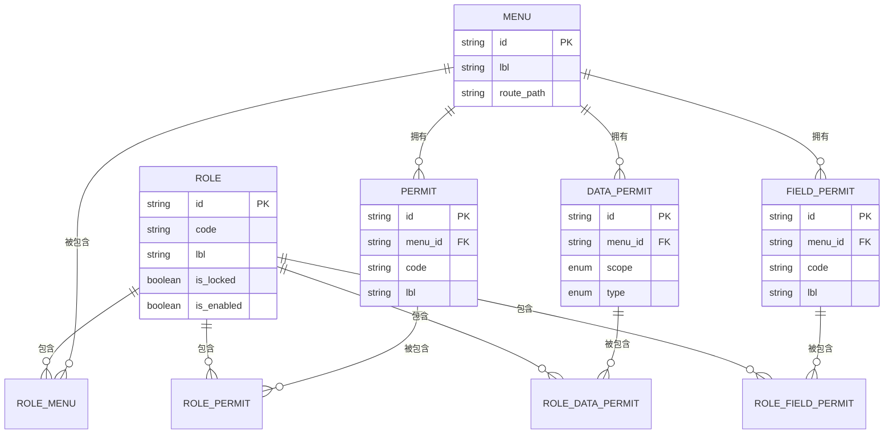
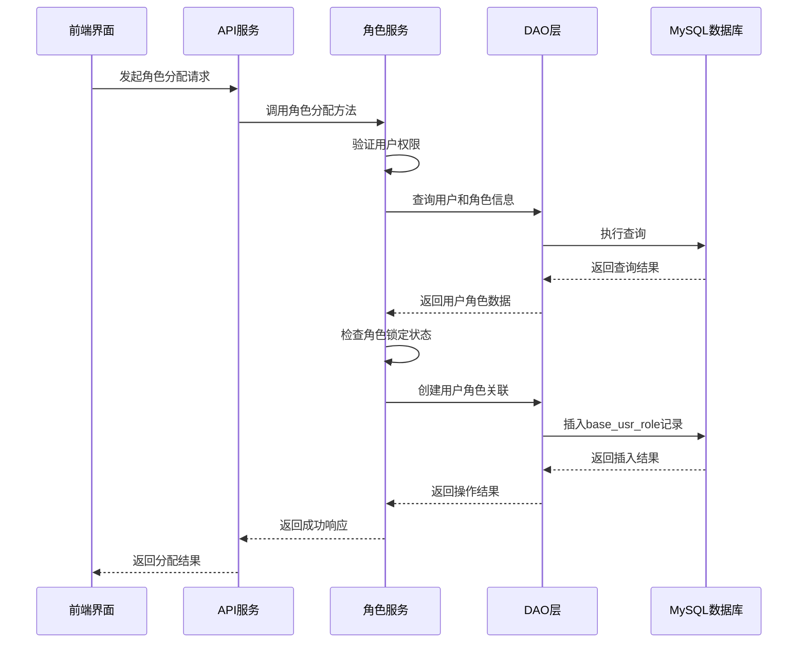
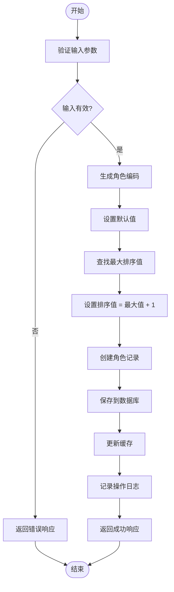

# 角色管理

**本文档引用的文件**  
- [role_model.rs](https://github.com/sail-sail/nest/blob/main/rust/generated/base/role/role_model.rs)
- [role_service.rs](https://github.com/sail-sail/nest/blob/main/rust/generated/base/role/role_service.rs)
- [List.vue](https://github.com/sail-sail/nest/blob/main/pc/src/views/base/role/List.vue)
- [Detail.vue](https://github.com/sail-sail/nest/blob/main/pc/src/views/base/role/Detail.vue)
- [base.sql](https://github.com/sail-sail/nest/blob/main/codegen/src/tables/base/base.sql)

## 目录
1. [角色实体设计](#角色实体设计)
2. [角色与权限的关联机制](#角色与权限的关联机制)
3. [角色分配的业务逻辑](#角色分配的业务逻辑)
4. [权限继承与覆盖处理](#权限继承与覆盖处理)
5. [角色创建与权限分配流程](#角色创建与权限分配流程)
6. [GraphQL查询中的权限加载优化](#graphql查询中的权限加载优化)
7. [前端界面功能实现](#前端界面功能实现)
8. [二次开发指导](#二次开发指导)

## 角色实体设计

角色实体（RoleModel）在系统中作为权限管理的核心数据结构，定义了角色的基本属性和权限集合。该实体通过Rust的`SimpleObject`宏导出为GraphQL类型，确保前后端数据交互的一致性。

角色模型包含以下核心字段：
- **基础信息**：ID、编码（code）、名称（lbl）、首页（home_url）、排序（order_by）、备注（rem）
- **状态控制**：是否锁定（is_locked）、是否启用（is_enabled）
- **权限集合**：菜单权限（menu_ids）、按钮权限（permit_ids）、数据权限（data_permit_ids）、字段权限（field_permit_ids）
- **系统元数据**：租户ID（tenant_id）、创建人、更新人、创建时间、更新时间

权限集合字段采用`Vec<T>`类型存储，其中T为对应权限的ID类型（如MenuId、PermitId等），实现了权限的多对多关系管理。所有权限字段均通过GraphQL的`name`属性进行命名转换，确保API接口的命名规范。

**Section sources**
- [role_model.rs](https://github.com/sail-sail/nest/blob/main/rust/generated/base/role/role_model.rs#L1-L100)

## 角色与权限的关联机制

系统通过多张关联表实现角色与各类权限的多对多关系管理，确保权限分配的灵活性和可追溯性。数据库设计遵循规范化原则，通过外键约束保证数据完整性。

### 数据库关联结构

**Diagram sources**
- [base.sql](https://github.com/sail-sail/nest/blob/main/codegen/src/tables/base/base.sql#L150-L250)

### 权限存储方式

角色的权限集合在数据库中以JSON格式存储，通过`HashMap<String, T>`结构实现有序存储。这种设计解决了传统数组存储无法保证顺序的问题，同时保留了JSON的灵活性。

在`RoleModel`的`FromRow`实现中，权限字段的解析逻辑如下：
1. 从数据库读取JSON格式的权限ID映射
2. 提取映射中的键（字符串形式的序号）并转换为u32
3. 对序号进行排序，确保权限按预定顺序加载
4. 根据排序后的序号依次获取对应的权限ID，构建有序的Vec

这种存储方式既保证了权限的有序性，又避免了频繁的JOIN查询，提升了数据加载性能。

**Section sources**
- [role_model.rs](https://github.com/sail-sail/nest/blob/main/rust/generated/base/role/role_model.rs#L101-L300)
- [base.sql](https://github.com/sail-sail/nest/blob/main/codegen/src/tables/base/base.sql#L150-L250)

## 角色分配的业务逻辑

角色分配涉及用户与角色的关联管理，通过`base_usr_role`表实现用户-角色多对多关系。系统提供了完整的CRUD操作接口，确保角色分配的安全性和可审计性。

### 用户角色绑定流程

**Diagram sources**
- [role_service.rs](https://github.com/sail-sail/nest/blob/main/rust/generated/base/role/role_service.rs#L1-L50)

### 业务规则验证

在角色分配过程中，系统实施了严格的业务规则验证：
- **权限检查**：操作者必须具有相应的角色管理权限
- **状态检查**：禁止对已锁定的角色进行修改或删除
- **系统保护**：禁止删除系统内置角色
- **租户隔离**：确保角色分配在正确的租户上下文中进行

这些规则通过服务层的方法实现，如`update_by_id_role`方法中对角色锁定状态的检查，确保了数据的一致性和安全性。

**Section sources**
- [role_service.rs](https://github.com/sail-sail/nest/blob/main/rust/generated/base/role/role_service.rs#L200-L300)

## 权限继承与覆盖处理

系统通过服务层的业务逻辑实现权限的继承与覆盖处理，确保权限分配的灵活性和可预测性。权限处理遵循"显式优先"原则，即直接分配的权限优先于继承的权限。

### 权限继承机制

权限继承主要通过以下方式实现：
1. **角色继承**：通过角色层级结构（需二次开发实现）实现权限的逐级继承
2. **租户继承**：租户级别的权限设置自动应用于该租户下的所有角色
3. **默认权限**：新创建的角色自动继承系统预设的默认权限集

### 权限覆盖逻辑

当存在权限冲突时，系统按照以下优先级进行处理：
1. **显式分配权限**：直接为角色分配的权限具有最高优先级
2. **继承权限**：从父角色或租户继承的权限
3. **系统默认权限**：系统预设的最低权限集

在`RoleInput`结构体中，权限字段设计为`Option<Vec<T>>`类型，允许部分更新。当更新角色权限时，如果某个权限字段为`None`，则保持原有权限不变；如果为`Some(vec)`，则完全替换原有权限集，实现权限的精确控制。

**Section sources**
- [role_model.rs](https://github.com/sail-sail/nest/blob/main/rust/generated/base/role/role_model.rs#L301-L400)
- [role_service.rs](https://github.com/sail-sail/nest/blob/main/rust/generated/base/role/role_service.rs#L301-L400)

## 角色创建与权限分配流程

角色的完整生命周期管理包括创建、权限分配、用户绑定等操作，系统提供了清晰的API接口和业务流程。

### 角色创建流程

**Diagram sources**
- [role_service.rs](https://github.com/sail-sail/nest/blob/main/rust/generated/base/role/role_service.rs#L401-L422)

### 权限分配实现

权限分配通过批量操作接口实现，支持同时为角色分配多种类型的权限。关键方法包括：
- `creates_role`：批量创建角色
- `update_by_id_role`：更新角色信息及权限
- `enable_by_ids_role`：批量启用/禁用角色
- `lock_by_ids_role`：批量锁定/解锁角色

前端通过`Detail.vue`组件实现权限的可视化分配，用户可以在表单中直接选择菜单、按钮、数据和字段权限，系统自动处理权限的保存和验证。

**Section sources**
- [role_service.rs](https://github.com/sail-sail/nest/blob/main/rust/generated/base/role/role_service.rs#L100-L200)
- [Detail.vue](https://github.com/sail-sail/nest/blob/main/pc/src/views/base/role/Detail.vue#L1-L200)

## GraphQL查询中的权限加载优化

系统通过GraphQL的查询优化技术提升角色权限数据的加载性能，减少网络传输和数据库查询开销。

### 查询字段优化

在`RoleModel`定义中，使用`#[graphql(skip)]`注解标记不需要通过GraphQL暴露的字段，如`tenant_id`、`is_deleted`等系统字段。这减少了不必要的数据传输，提升了API响应速度。

### 分页与排序支持

角色查询服务支持分页和排序功能，通过`PageInput`和`SortInput`参数实现：
- **分页查询**：`find_all_role`方法支持分页参数，避免一次性加载大量数据
- **排序支持**：`get_can_sort_in_api_role`函数定义了前端允许排序的字段列表，确保排序操作的安全性
- **条件查询**：`RoleSearch`结构体提供了丰富的搜索条件，支持关键字、状态、时间范围等多种过滤方式

### 数据预加载

系统通过`find_by_ids_ok_role`等方法实现批量数据预加载，减少数据库查询次数。在用户管理界面需要显示多个角色信息时，可以一次性获取所有相关角色数据，避免N+1查询问题。

**Section sources**
- [role_model.rs](https://github.com/sail-sail/nest/blob/main/rust/generated/base/role/role_model.rs#L401-L500)
- [role_service.rs](https://github.com/sail-sail/nest/blob/main/rust/generated/base/role/role_service.rs#L50-L100)

## 前端界面功能实现

前端界面基于Vue3和Element Plus组件库构建，提供了完整的角色管理功能，包括列表展示、详情编辑、权限分配等。

### 列表界面功能

`List.vue`组件实现了角色的列表管理和批量操作：
- **树形选择器**：使用`CustomTreeSelect`组件实现菜单权限的树形选择，支持多选和搜索
- **批量操作**：提供新增、复制、编辑、删除、启用、禁用、锁定等批量操作按钮
- **回收站功能**：通过`is_deleted`字段区分正常角色和已删除角色，支持还原和彻底删除
- **列操作**：`TableShowColumns`组件允许用户自定义表格列的显示和隐藏

### 详情界面功能

`Detail.vue`组件提供了角色的详细信息编辑功能：
- **表单验证**：使用`el-form`的验证规则确保输入数据的合法性
- **只读模式**：通过`isReadonly`标志控制表单的编辑状态，支持查看模式
- **导航功能**：支持在多个角色之间快速切换，提供上一项、下一项导航按钮
- **权限预览**：在详情界面直接显示角色拥有的各类权限数量，点击可查看详细权限列表

### 权限选择组件

系统提供了专门的权限选择组件，实现权限的树形展示和选择：
- `MenuTreeList`：菜单权限树形选择
- `PermitTreeList`：按钮权限树形选择
- `DataPermitTreeList`：数据权限树形选择  
- `FieldPermitTreeList`：字段权限树形选择

这些组件通过`ListSelectDialog`对话框包装，提供一致的用户体验。

**Section sources**
- [List.vue](https://github.com/sail-sail/nest/blob/main/pc/src/views/base/role/List.vue#L1-L1000)
- [Detail.vue](https://github.com/sail-sail/nest/blob/main/pc/src/views/base/role/Detail.vue#L201-L400)

## 二次开发指导

### 实现角色层级结构

要实现角色的层级继承结构，建议进行以下扩展：
1. 在`base_role`表中添加`parent_id`字段，指向父角色
2. 修改`RoleModel`结构体，添加`parent_id: Option<RoleId>`字段
3. 在服务层添加`get_inherited_permissions`方法，递归获取父角色的权限
4. 修改权限验证逻辑，合并当前角色权限和继承的权限

### 动态权限计算

实现动态权限计算的建议方案：
1. 添加权限计算规则表，存储动态权限的计算逻辑
2. 在`RoleService`中添加`calculate_dynamic_permissions`方法
3. 使用表达式引擎解析和执行权限计算规则
4. 在角色加载时自动计算并合并动态权限

### 自定义权限类型

扩展自定义权限类型的方法：
1. 创建新的权限实体（如`CustomPermit`）
2. 添加对应的关联表（如`base_role_custom_permit`）
3. 在`RoleModel`中添加新的权限字段
4. 实现相应的DAO和服务方法
5. 在前端添加对应的权限选择组件

这些扩展需要同步更新数据库Schema、Rust模型、GraphQL Schema和前端组件，确保全栈一致性。

**Section sources**
- [role_model.rs](https://github.com/sail-sail/nest/blob/main/rust/generated/base/role/role_model.rs)
- [role_service.rs](https://github.com/sail-sail/nest/blob/main/rust/generated/base/role/role_service.rs)
- [List.vue](https://github.com/sail-sail/nest/blob/main/pc/src/views/base/role/List.vue)
- [Detail.vue](https://github.com/sail-sail/nest/blob/main/pc/src/views/base/role/Detail.vue)
- [base.sql](https://github.com/sail-sail/nest/blob/main/codegen/src/tables/base/base.sql)