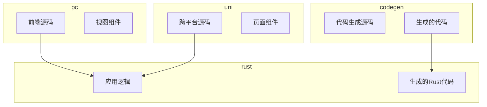
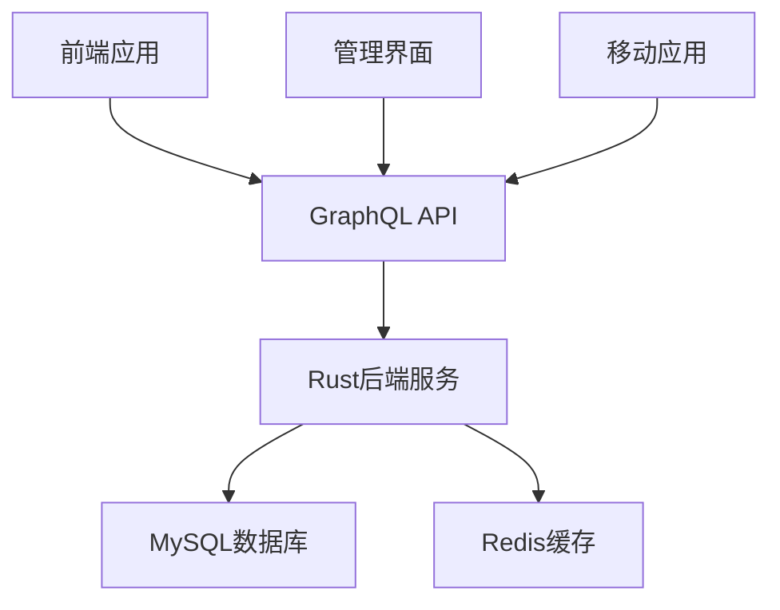
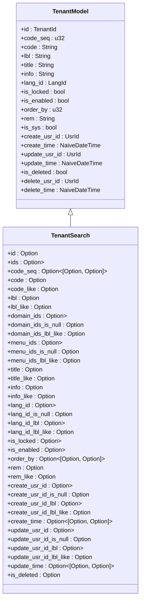
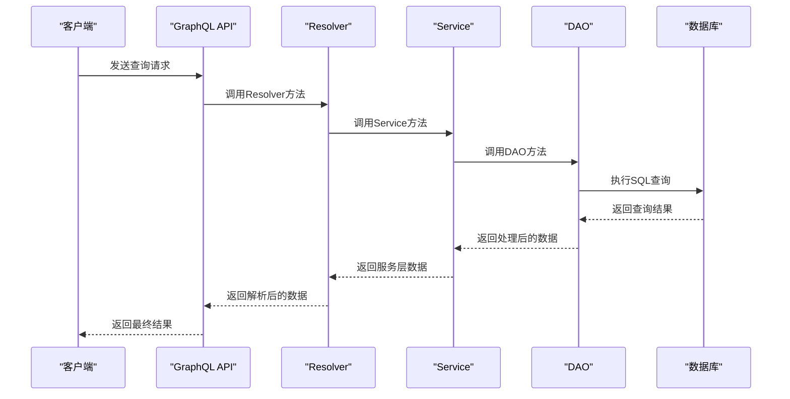
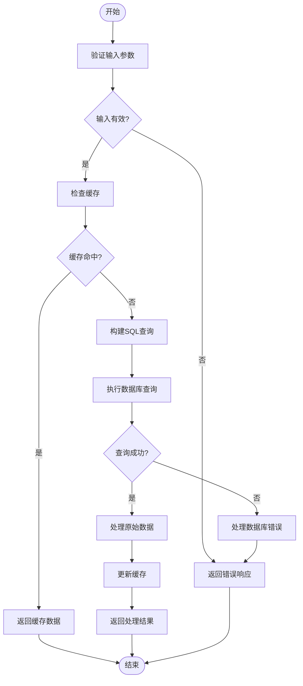
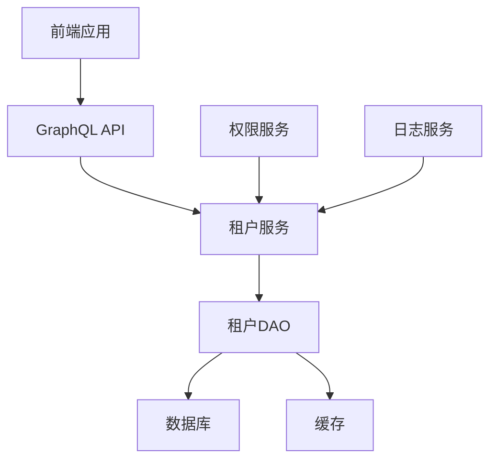

# 租户管理

**本文档引用的文件**  
- [base.sql](https://github.com/sail-sail/nest/blob/main/codegen/src/tables/base/base.sql)
- [tenant_graphql.rs](https://github.com/sail-sail/nest/blob/main/rust/generated/base/tenant/tenant_graphql.rs)
- [tenant_resolver.rs](https://github.com/sail-sail/nest/blob/main/rust/generated/base/tenant/tenant_resolver.rs)
- [tenant_dao.rs](https://github.com/sail-sail/nest/blob/main/rust/generated/base/tenant/tenant_dao.rs)
- [tenant_model.rs](https://github.com/sail-sail/nest/blob/main/rust/generated/base/tenant/tenant_model.rs)
- [context.rs](https://github.com/sail-sail/nest/blob/main/rust/generated/common/context.rs)
- [Api.ts](https://github.com/sail-sail/nest/blob/main/pc/src/views/base/tenant/Api.ts)

## 目录
1. [引言](#引言)
2. [项目结构](#项目结构)
3. [核心组件](#核心组件)
4. [架构概述](#架构概述)
5. [详细组件分析](#详细组件分析)
6. [依赖分析](#依赖分析)
7. [性能考虑](#性能考虑)
8. [故障排除指南](#故障排除指南)
9. [结论](#结论)

## 引言
本文档详细介绍了多租户架构的实现机制，重点阐述了租户实体的设计与实现。文档涵盖了租户信息管理、租户隔离策略等核心概念，并深入探讨了数据库层面的租户隔离方案。通过具体代码示例，展示了GraphQL查询中的租户上下文传递、权限验证和数据过滤等关键环节。此外，还提供了租户配置管理和生命周期管理的最佳实践，以及在高并发场景下的性能优化建议。

## 项目结构
本项目采用分层架构设计，主要分为codegen、pc、rust和uni四个模块。codegen模块负责代码生成，pc模块为前端应用，rust模块为核心后端服务，uni模块为跨平台应用。项目结构清晰，各模块职责明确，便于维护和扩展。

**图示来源**  
- [base.sql](https://github.com/sail-sail/nest/blob/main/codegen/src/tables/base/base.sql)
- [tenant_graphql.rs](https://github.com/sail-sail/nest/blob/main/rust/generated/base/tenant/tenant_graphql.rs)

**本节来源**  
- [base.sql](https://github.com/sail-sail/nest/blob/main/codegen/src/tables/base/base.sql)
- [tenant_graphql.rs](https://github.com/sail-sail/nest/blob/main/rust/generated/base/tenant/tenant_graphql.rs)

## 核心组件
租户管理模块的核心组件包括租户实体、租户服务、租户数据访问对象和租户GraphQL接口。这些组件协同工作，实现了租户的创建、查询、更新和删除等基本操作，同时确保了多租户环境下的数据隔离和安全性。

**本节来源**  
- [tenant_graphql.rs](https://github.com/sail-sail/nest/blob/main/rust/generated/base/tenant/tenant_graphql.rs)
- [tenant_resolver.rs](https://github.com/sail-sail/nest/blob/main/rust/generated/base/tenant/tenant_resolver.rs)
- [tenant_dao.rs](https://github.com/sail-sail/nest/blob/main/rust/generated/base/tenant/tenant_dao.rs)

## 架构概述
系统采用微服务架构，前端通过GraphQL接口与后端进行通信。后端服务基于Rust实现，利用async-graphql框架提供GraphQL API。数据存储采用MySQL数据库，通过sqlx库进行数据库操作。整个系统设计注重性能和可扩展性，支持高并发访问。

**图示来源**  
- [tenant_graphql.rs](https://github.com/sail-sail/nest/blob/main/rust/generated/base/tenant/tenant_graphql.rs)
- [context.rs](https://github.com/sail-sail/nest/blob/main/rust/generated/common/context.rs)

## 详细组件分析

### 租户实体分析
租户实体是多租户系统的核心，包含了租户的基本信息和配置。实体设计考虑了数据完整性和查询效率，通过合理的索引设置和字段约束，确保了数据的一致性和访问性能。

#### 租户实体类图

**图示来源**  
- [tenant_model.rs](https://github.com/sail-sail/nest/blob/main/rust/generated/base/tenant/tenant_model.rs)
- [tenant_dao.rs](https://github.com/sail-sail/nest/blob/main/rust/generated/base/tenant/tenant_dao.rs)

#### GraphQL查询流程

**图示来源**  
- [tenant_graphql.rs](https://github.com/sail-sail/nest/blob/main/rust/generated/base/tenant/tenant_graphql.rs)
- [tenant_resolver.rs](https://github.com/sail-sail/nest/blob/main/rust/generated/base/tenant/tenant_resolver.rs)

#### 租户查询逻辑流程图

**图示来源**  
- [tenant_dao.rs](https://github.com/sail-sail/nest/blob/main/rust/generated/base/tenant/tenant_dao.rs)
- [context.rs](https://github.com/sail-sail/nest/blob/main/rust/generated/common/context.rs)

**本节来源**  
- [tenant_model.rs](https://github.com/sail-sail/nest/blob/main/rust/generated/base/tenant/tenant_model.rs)
- [tenant_dao.rs](https://github.com/sail-sail/nest/blob/main/rust/generated/base/tenant/tenant_dao.rs)
- [tenant_resolver.rs](https://github.com/sail-sail/nest/blob/main/rust/generated/base/tenant/tenant_resolver.rs)

### 租户生命周期管理
租户生命周期管理涵盖了租户的创建、启用、禁用、锁定和删除等操作。每个操作都经过严格的权限验证和业务规则检查，确保系统的安全性和数据的完整性。

**本节来源**  
- [tenant_graphql.rs](https://github.com/sail-sail/nest/blob/main/rust/generated/base/tenant/tenant_graphql.rs)
- [tenant_resolver.rs](https://github.com/sail-sail/nest/blob/main/rust/generated/base/tenant/tenant_resolver.rs)

## 依赖分析
系统各组件之间存在明确的依赖关系。前端应用依赖于GraphQL API，GraphQL API依赖于后端服务，后端服务又依赖于数据库和缓存系统。这种分层依赖结构有助于系统的模块化和可维护性。

**图示来源**  
- [tenant_graphql.rs](https://github.com/sail-sail/nest/blob/main/rust/generated/base/tenant/tenant_graphql.rs)
- [context.rs](https://github.com/sail-sail/nest/blob/main/rust/generated/common/context.rs)

**本节来源**  
- [tenant_graphql.rs](https://github.com/sail-sail/nest/blob/main/rust/generated/base/tenant/tenant_graphql.rs)
- [context.rs](https://github.com/sail-sail/nest/blob/main/rust/generated/common/context.rs)

## 性能考虑
在高并发场景下，系统性能是关键考量因素。通过合理的数据库索引设计、查询优化和缓存策略，系统能够有效应对大量并发请求。此外，异步处理和连接池技术的应用也大大提升了系统的响应速度和吞吐量。

**本节来源**  
- [context.rs](https://github.com/sail-sail/nest/blob/main/rust/generated/common/context.rs)
- [tenant_dao.rs](https://github.com/sail-sail/nest/blob/main/rust/generated/base/tenant/tenant_dao.rs)

## 故障排除指南
当系统出现异常时，首先应检查日志文件，定位问题根源。常见的问题包括数据库连接失败、缓存失效和权限验证错误。针对不同问题，应采取相应的解决措施，如重启服务、清除缓存或重新配置权限。

**本节来源**  
- [context.rs](https://github.com/sail-sail/nest/blob/main/rust/generated/common/context.rs)
- [tenant_resolver.rs](https://github.com/sail-sail/nest/blob/main/rust/generated/base/tenant/tenant_resolver.rs)

## 结论
本文档全面介绍了租户管理模块的设计与实现，涵盖了从实体设计到API接口的各个方面。通过详细的代码分析和架构图示，为开发者提供了清晰的系统理解。在实际应用中，应根据具体需求灵活调整配置，确保系统的稳定性和性能。