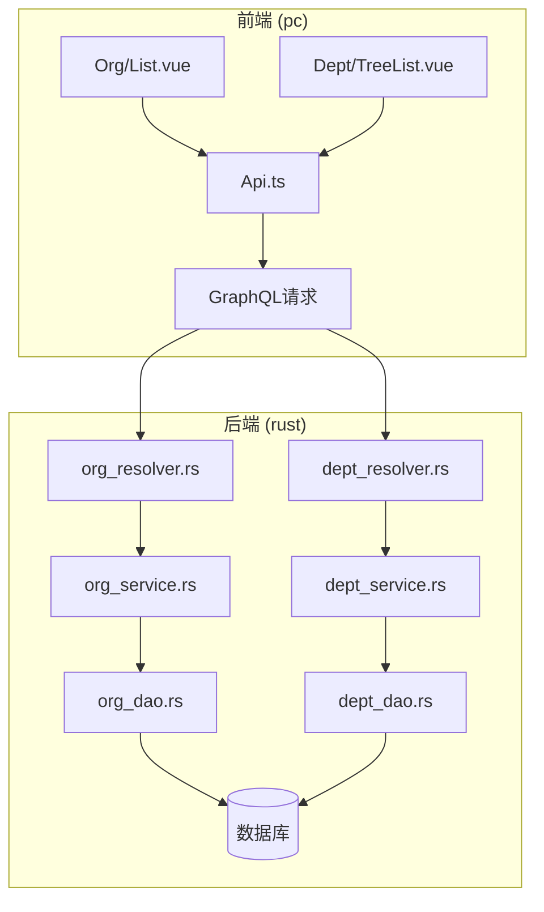
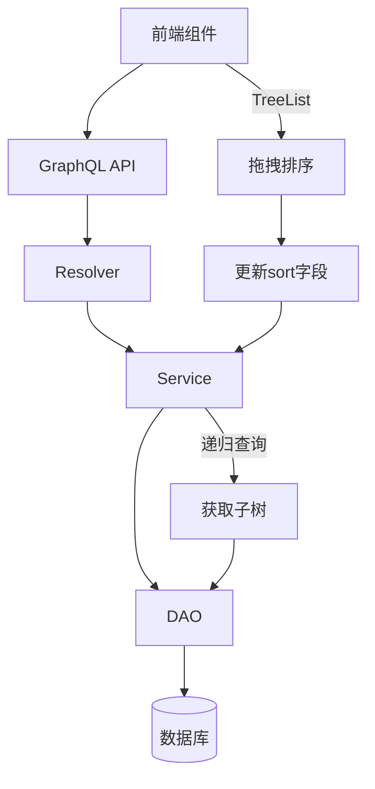
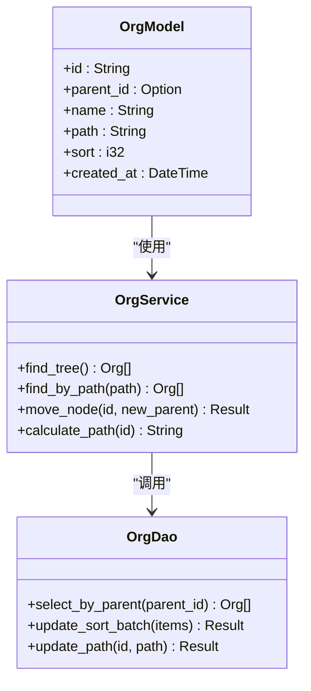
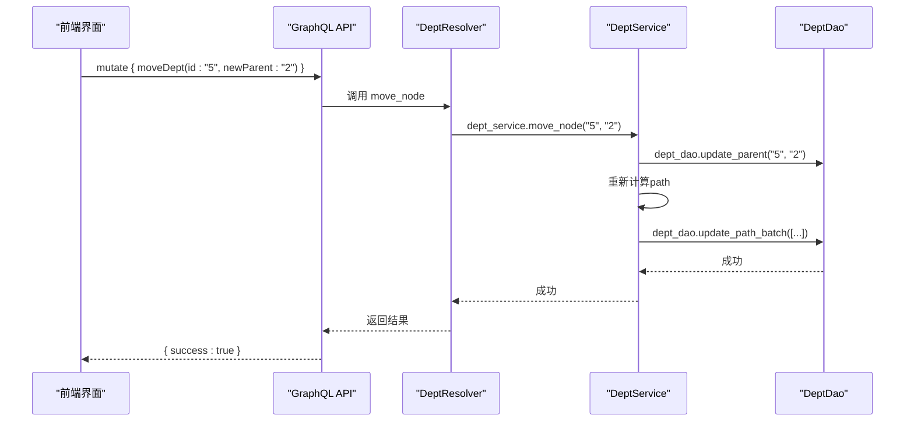
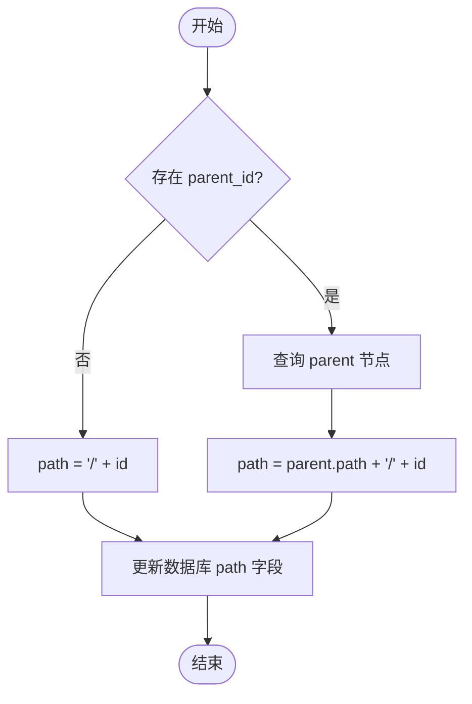
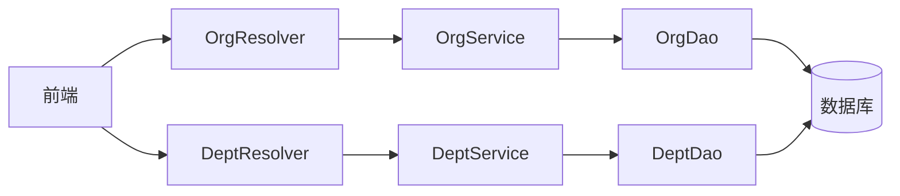

# 组织架构管理

**本文档引用的文件**  
- [org_model.rs](https://github.com/sail-sail/nest/blob/main/rust/generated/base/org/org_model.rs)
- [org_service.rs](https://github.com/sail-sail/nest/blob/main/rust/generated/base/org/org_service.rs)
- [org_dao.rs](https://github.com/sail-sail/nest/blob/main/rust/generated/base/org/org_dao.rs)
- [org_graphql.rs](https://github.com/sail-sail/nest/blob/main/rust/generated/base/org/org_graphql.rs)
- [org_resolver.rs](https://github.com/sail-sail/nest/blob/main/rust/generated/base/org/org_resolver.rs)
- [dept_model.rs](https://github.com/sail-sail/nest/blob/main/rust/generated/base/dept/dept_model.rs)
- [dept_service.rs](https://github.com/sail-sail/nest/blob/main/rust/generated/base/dept/dept_service.rs)
- [dept_dao.rs](https://github.com/sail-sail/nest/blob/main/rust/generated/base/dept/dept_dao.rs)
- [dept_graphql.rs](https://github.com/sail-sail/nest/blob/main/rust/generated/base/dept/dept_graphql.rs)
- [dept_resolver.rs](https://github.com/sail-sail/nest/blob/main/rust/generated/base/dept/dept_resolver.rs)
- [Api.ts](https://github.com/sail-sail/nest/blob/main/pc/src/views/base/org/Api.ts)
- [List.vue](https://github.com/sail-sail/nest/blob/main/pc/src/views/base/org/List.vue)
- [TreeList.vue](https://github.com/sail-sail/nest/blob/main/pc/src/views/base/dept/TreeList.vue)
- [Model.ts](https://github.com/sail-sail/nest/blob/main/pc/src/views/base/org/Model.ts)

## 目录
1. [简介](#简介)
2. [项目结构](#项目结构)
3. [核心组件](#核心组件)
4. [架构概览](#架构概览)
5. [详细组件分析](#详细组件分析)
6. [依赖分析](#依赖分析)
7. [性能考虑](#性能考虑)
8. [故障排除指南](#故障排除指南)
9. [结论](#结论)

## 简介
本文档详细描述了组织（org）和部门（dept）两个核心实体的设计与实现，重点介绍其在树形结构中的管理机制。涵盖层级关系维护、路径计算、递归查询等关键技术细节，并说明前后端如何协同完成组织架构的增删改查操作，特别是树形结构的可视化展示与拖拽排序功能。通过具体代码示例展示GraphQL接口设计、数据库表结构及前端组件实现，同时提供大规模组织架构下的性能优化建议。

## 项目结构
系统采用前后端分离架构，组织与部门模块分别在Rust后端和TypeScript前端中实现。后端位于`rust/generated/base/org`和`dept`目录下，包含DAO、Service、GraphQL接口等分层结构；前端位于`pc/src/views/base/org`和`dept`目录下，包含API定义、视图组件和数据模型。

**图示来源**  
- [List.vue](https://github.com/sail-sail/nest/blob/main/pc/src/views/base/org/List.vue)
- [TreeList.vue](https://github.com/sail-sail/nest/blob/main/pc/src/views/base/dept/TreeList.vue)
- [org_resolver.rs](https://github.com/sail-sail/nest/blob/main/rust/generated/base/org/org_resolver.rs)
- [dept_resolver.rs](https://github.com/sail-sail/nest/blob/main/rust/generated/base/dept/dept_resolver.rs)

**本节来源**  
- [org](https://github.com/sail-sail/nest/blob/main/rust/generated/base/org/)
- [dept](https://github.com/sail-sail/nest/blob/main/rust/generated/base/dept/)
- [org](https://github.com/sail-sail/nest/blob/main/pc/src/views/base/org/)
- [dept](https://github.com/sail-sail/nest/blob/main/pc/src/views/base/dept/)

## 核心组件
组织（org）和部门（dept）均采用树形结构设计，支持无限层级嵌套。每个节点包含`id`、`parent_id`、`name`、`path`、`sort`等关键字段，其中`path`字段用于快速查询祖先路径，`sort`用于排序控制。

**本节来源**  
- [org_model.rs](https://github.com/sail-sail/nest/blob/main/rust/generated/base/org/org_model.rs#L10-L50)
- [dept_model.rs](https://github.com/sail-sail/nest/blob/main/rust/generated/base/dept/dept_model.rs#L10-L50)

## 架构概览
系统采用典型的分层架构：前端视图层 → GraphQL接口层 → 业务服务层 → 数据访问层 → 数据库。

**图示来源**  
- [org_graphql.rs](https://github.com/sail-sail/nest/blob/main/rust/generated/base/org/org_graphql.rs)
- [dept_graphql.rs](https://github.com/sail-sail/nest/blob/main/rust/generated/base/dept/dept_graphql.rs)
- [org_service.rs](https://github.com/sail-sail/nest/blob/main/rust/generated/base/org/org_service.rs)
- [dept_service.rs](https://github.com/sail-sail/nest/blob/main/rust/generated/base/dept/dept_service.rs)

## 详细组件分析

### 组织模块分析
组织实体支持树形结构管理，通过`parent_id`建立父子关系，`path`字段存储从根到当前节点的完整路径（如`/1/3/7`），便于高效查询所有子节点或祖先节点。

#### 类图

**图示来源**  
- [org_model.rs](https://github.com/sail-sail/nest/blob/main/rust/generated/base/org/org_model.rs)
- [org_service.rs](https://github.com/sail-sail/nest/blob/main/rust/generated/base/org/org_service.rs)
- [org_dao.rs](https://github.com/sail-sail/nest/blob/main/rust/generated/base/org/org_dao.rs)

**本节来源**  
- [org_model.rs](https://github.com/sail-sail/nest/blob/main/rust/generated/base/org/org_model.rs#L1-L100)
- [org_service.rs](https://github.com/sail-sail/nest/blob/main/rust/generated/base/org/org_service.rs#L1-L150)
- [org_dao.rs](https://github.com/sail-sail/nest/blob/main/rust/generated/base/org/org_dao.rs#L1-L100)

### 部门模块分析
部门模块与组织模块结构相似，但增加了前端树形控件支持，提供可视化拖拽排序功能。

#### 序列图：拖拽排序流程

**图示来源**  
- [dept_resolver.rs](https://github.com/sail-sail/nest/blob/main/rust/generated/base/dept/dept_resolver.rs#L45-L70)
- [dept_service.rs](https://github.com/sail-sail/nest/blob/main/rust/generated/base/dept/dept_service.rs#L80-L120)
- [dept_dao.rs](https://github.com/sail-sail/nest/blob/main/rust/generated/base/dept/dept_dao.rs#L30-L60)

#### 流程图：路径计算逻辑

**图示来源**  
- [org_service.rs](https://github.com/sail-sail/nest/blob/main/rust/generated/base/org/org_service.rs#L100-L130)
- [dept_service.rs](https://github.com/sail-sail/nest/blob/main/rust/generated/base/dept/dept_service.rs#L100-L130)

**本节来源**  
- [dept_model.rs](https://github.com/sail-sail/nest/blob/main/rust/generated/base/dept/dept_model.rs#L1-L100)
- [dept_service.rs](https://github.com/sail-sail/nest/blob/main/rust/generated/base/dept/dept_service.rs#L1-L150)
- [dept_dao.rs](https://github.com/sail-sail/nest/blob/main/rust/generated/base/dept/dept_dao.rs#L1-L100)
- [TreeList.vue](https://github.com/sail-sail/nest/blob/main/pc/src/views/base/dept/TreeList.vue#L1-L200)

## 依赖分析
组织与部门模块在后端共享相似的DAO和服务模式，均依赖于GraphQL框架进行接口暴露。前端通过统一的API抽象层与后端通信，降低耦合度。

**图示来源**  
- [org_resolver.rs](https://github.com/sail-sail/nest/blob/main/rust/generated/base/org/org_resolver.rs)
- [dept_resolver.rs](https://github.com/sail-sail/nest/blob/main/rust/generated/base/dept/dept_resolver.rs)
- [org_service.rs](https://github.com/sail-sail/nest/blob/main/rust/generated/base/org/org_service.rs)
- [dept_service.rs](https://github.com/sail-sail/nest/blob/main/rust/generated/base/dept/dept_service.rs)

**本节来源**  
- [org](https://github.com/sail-sail/nest/blob/main/rust/generated/base/org/)
- [dept](https://github.com/sail-sail/nest/blob/main/rust/generated/base/dept/)

## 性能考虑
对于大规模组织架构，建议采取以下优化策略：
- 使用`path`字段进行子树查询，避免递归SQL
- 对`path`字段建立数据库索引以加速模糊查询
- 前端采用虚拟滚动技术渲染大型树结构
- 启用GraphQL查询缓存，减少重复请求
- 批量更新`sort`字段时使用事务保证一致性

## 故障排除指南
常见问题及解决方案：
- **树形结构显示异常**：检查`path`字段是否正确更新，确认`parent_id`关系无环
- **拖拽排序失败**：验证GraphQL mutation参数格式，检查事务是否提交成功
- **查询性能低下**：确保`path`和`parent_id`字段已建立索引
- **循环引用错误**：在`move_node`服务层添加环路检测逻辑

**本节来源**  
- [org_service.rs](https://github.com/sail-sail/nest/blob/main/rust/generated/base/org/org_service.rs#L150-L200)
- [dept_service.rs](https://github.com/sail-sail/nest/blob/main/rust/generated/base/dept/dept_service.rs#L150-L200)
- [Api.ts](https://github.com/sail-sail/nest/blob/main/pc/src/views/base/org/Api.ts)

## 结论
组织与部门模块通过精心设计的树形结构模型，实现了灵活高效的层级管理。结合GraphQL接口与前端可视化组件，提供了完整的增删改查及拖拽排序功能。通过`path`路径字段和批量操作优化，系统能够良好支持大规模组织架构场景，具备良好的扩展性与维护性。