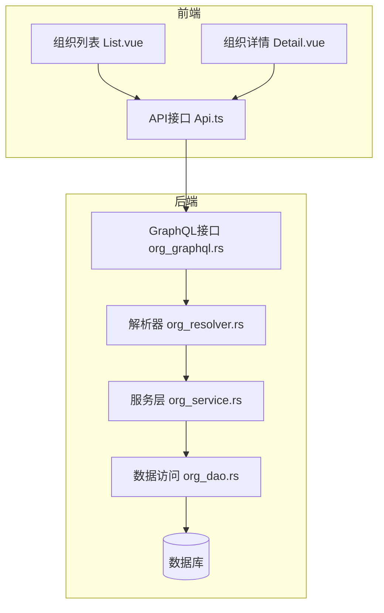
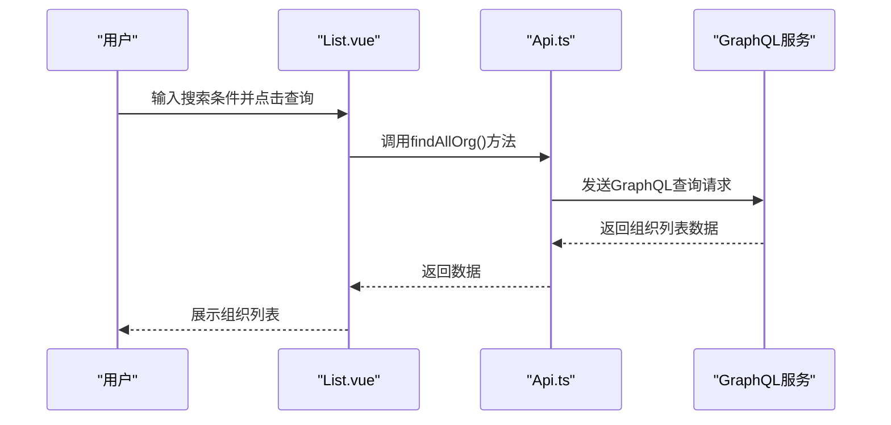
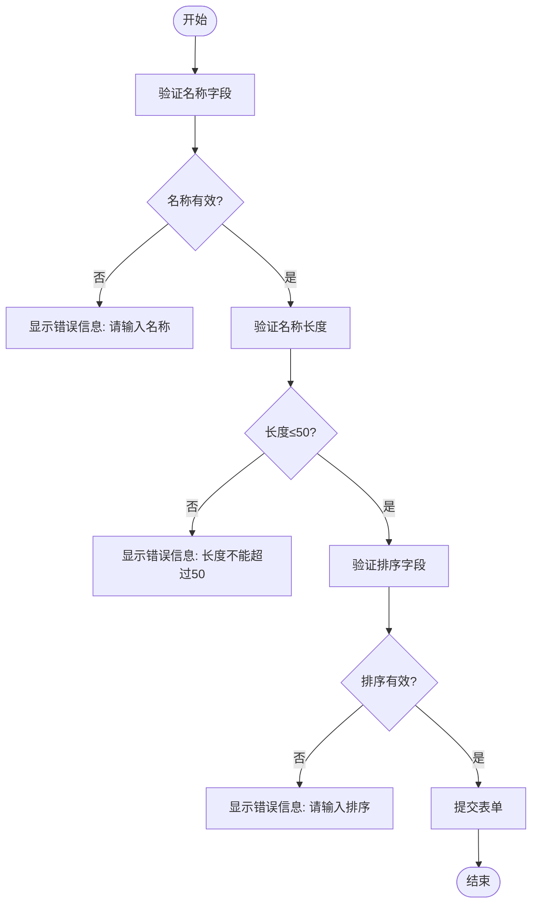
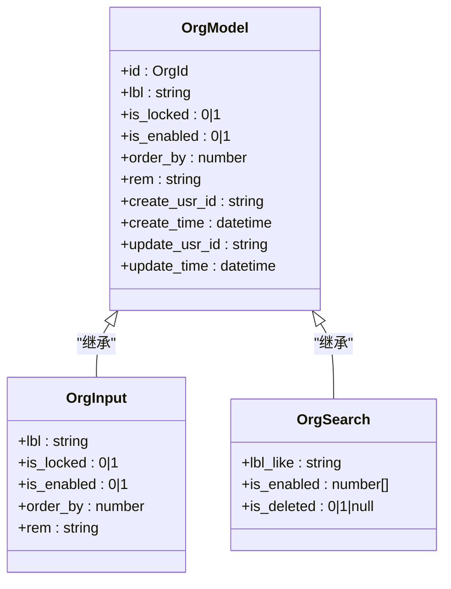
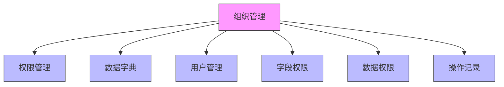

# 组织管理

**本文档引用文件**  
- [List.vue](https://github.com/sail-sail/nest/blob/main/pc/src/views/base/org/List.vue)
- [Detail.vue](https://github.com/sail-sail/nest/blob/main/pc/src/views/base/org/Detail.vue)
- [Api.ts](https://github.com/sail-sail/nest/blob/main/pc/src/views/base/org/Api.ts)
- [Model.ts](https://github.com/sail-sail/nest/blob/main/pc/src/views/base/org/Model.ts)
- [org_model.rs](https://github.com/sail-sail/nest/blob/main/rust/generated/base/org/org_model.rs)
- [org_graphql.rs](https://github.com/sail-sail/nest/blob/main/rust/generated/base/org/org_graphql.rs)
- [org_resolver.rs](https://github.com/sail-sail/nest/blob/main/rust/generated/base/org/org_resolver.rs)
- [org_service.rs](https://github.com/sail-sail/nest/blob/main/rust/generated/base/org/org_service.rs)
- [org_dao.rs](https://github.com/sail-sail/nest/blob/main/rust/generated/base/org/org_dao.rs)

## 目录
1. [简介](#简介)
2. [项目结构](#项目结构)
3. [核心组件](#核心组件)
4. [架构概述](#架构概述)
5. [详细组件分析](#详细组件分析)
6. [依赖分析](#依赖分析)
7. [性能考虑](#性能考虑)
8. [故障排除指南](#故障排除指南)
9. [结论](#结论)

## 简介
本文档详细介绍了组织（org）实体的设计与实现，涵盖其数据模型、GraphQL接口设计、前后端交互机制以及数据权限控制策略。重点说明了组织编码、名称、层级路径、父组织ID等关键字段的业务含义，并通过代码示例展示组织树形结构的构建与渲染方式。

## 项目结构
组织管理功能分布在前端Vue组件和后端Rust服务中，采用分层架构设计。前端位于`pc/src/views/base/org`目录，包含List.vue和Detail.vue两个核心组件；后端位于`rust/generated/base/org`目录，包含模型、服务、数据访问等模块。

**目录结构来源**
- [List.vue](https://github.com/sail-sail/nest/blob/main/pc/src/views/base/org/List.vue)
- [org_service.rs](https://github.com/sail-sail/nest/blob/main/rust/generated/base/org/org_service.rs)

## 核心组件
组织管理功能的核心组件包括前端的List.vue（组织列表）和Detail.vue（组织详情），以及后端的org_service.rs（组织服务）和org_model.rs（组织模型）。这些组件共同实现了组织的增删改查、搜索、分页、导入导出等功能。

**组件来源**
- [List.vue](https://github.com/sail-sail/nest/blob/main/pc/src/views/base/org/List.vue#L1-L1749)
- [Detail.vue](https://github.com/sail-sail/nest/blob/main/pc/src/views/base/org/Detail.vue#L1-L760)
- [org_service.rs](https://github.com/sail-sail/nest/blob/main/rust/generated/base/org/org_service.rs#L1-L500)

## 架构概述
系统采用前后端分离架构，前端通过GraphQL接口与后端通信。组织实体通过GraphQL查询获取数据，支持按名称、启用状态等条件进行搜索和过滤。前端组件使用Composition API管理状态，后端服务采用领域驱动设计模式。

**图表来源**
- [List.vue](https://github.com/sail-sail/nest/blob/main/pc/src/views/base/org/List.vue#L1-L1749)
- [Api.ts](https://github.com/sail-sail/nest/blob/main/pc/src/views/base/org/Api.ts#L1-L705)
- [org_graphql.rs](https://github.com/sail-sail/nest/blob/main/rust/generated/base/org/org_graphql.rs#L1-L100)

## 详细组件分析

### 组织列表组件分析
组织列表组件实现了组织数据的展示、搜索、分页和批量操作功能。支持按名称模糊搜索、按启用状态筛选，并提供新增、编辑、删除、启用/禁用等操作按钮。

#### 组件交互流程

**图表来源**
- [List.vue](https://github.com/sail-sail/nest/blob/main/pc/src/views/base/org/List.vue#L1-L1749)
- [Api.ts](https://github.com/sail-sail/nest/blob/main/pc/src/views/base/org/Api.ts#L1-L705)

### 组织详情组件分析
组织详情组件用于组织信息的创建、编辑和查看。支持表单验证、重置、保存等操作，并提供前后导航功能，方便在多个组织间快速切换。

#### 表单验证逻辑

**图表来源**
- [Detail.vue](https://github.com/sail-sail/nest/blob/main/pc/src/views/base/org/Detail.vue#L1-L760)
- [Api.ts](https://github.com/sail-sail/nest/blob/main/pc/src/views/base/org/Api.ts#L1-L705)

### GraphQL接口设计
GraphQL接口提供了完整的组织管理操作，包括查询所有组织、根据ID获取组织、创建、更新、删除组织等。接口设计遵循RESTful原则，使用标准的查询、变更操作。

#### 查询操作
- `findAllOrg`: 查询所有组织，支持分页、排序和条件过滤
- `findOneOrg`: 根据条件查找单个组织
- `findByIdOrg`: 根据ID查找组织
- `findCountOrg`: 查询组织总数

#### 变更操作
- `createOrg`: 创建组织
- `updateByIdOrg`: 根据ID更新组织
- `deleteByIdsOrg`: 根据IDs删除组织
- `enableByIdsOrg`: 启用/禁用组织
- `lockByIdsOrg`: 锁定/解锁组织

**图表来源**
- [Api.ts](https://github.com/sail-sail/nest/blob/main/pc/src/views/base/org/Api.ts#L1-L705)
- [org_model.rs](https://github.com/sail-sail/nest/blob/main/rust/generated/base/org/org_model.rs#L1-L200)
- [org_graphql.rs](https://github.com/sail-sail/nest/blob/main/rust/generated/base/org/org_graphql.rs#L1-L150)

## 依赖分析
组织管理模块依赖于权限管理、数据字典、用户管理等基础服务。前端组件依赖Element Plus UI库和自定义组件库，后端服务依赖数据库访问层和通用工具库。

**图表来源**
- [Api.ts](https://github.com/sail-sail/nest/blob/main/pc/src/views/base/org/Api.ts#L1-L705)
- [org_service.rs](https://github.com/sail-sail/nest/blob/main/rust/generated/base/org/org_service.rs#L1-L500)
- [go.mod](https://github.com/sail-sail/nest/blob/main/rust/Cargo.toml#L1-L50)

## 性能考虑
为提高性能，系统采用了以下优化措施：
- 使用GraphQL精确查询所需字段，减少数据传输量
- 在列表页面支持分页加载，避免一次性加载大量数据
- 实现前端缓存机制，减少重复请求
- 数据库查询使用索引优化，提高查询效率
- 批量操作采用分批处理，避免内存溢出

## 故障排除指南
### 常见问题及解决方案
- **问题**: 组织列表加载缓慢
  - **原因**: 数据量过大未分页
  - **解决方案**: 确保启用分页功能，限制每页数据量

- **问题**: 无法保存组织信息
  - **原因**: 表单验证失败或权限不足
  - **解决方案**: 检查必填字段是否完整，确认用户具有编辑权限

- **问题**: 搜索功能无效
  - **原因**: 搜索条件未正确传递
  - **解决方案**: 检查search对象的构建逻辑，确保参数正确

- **问题**: 导入模板下载失败
  - **原因**: 文件路径错误或网络问题
  - **解决方案**: 检查服务器文件路径配置，确认网络连接正常

**问题来源**
- [List.vue](https://github.com/sail-sail/nest/blob/main/pc/src/views/base/org/List.vue#L1-L1749)
- [Detail.vue](https://github.com/sail-sail/nest/blob/main/pc/src/views/base/org/Detail.vue#L1-L760)
- [Api.ts](https://github.com/sail-sail/nest/blob/main/pc/src/views/base/org/Api.ts#L1-L705)

## 结论
组织管理功能通过前后端协同工作，实现了完整的组织生命周期管理。系统设计合理，接口清晰，具备良好的扩展性和维护性。建议在实际使用中注意数据权限控制，确保组织数据的安全性和一致性。