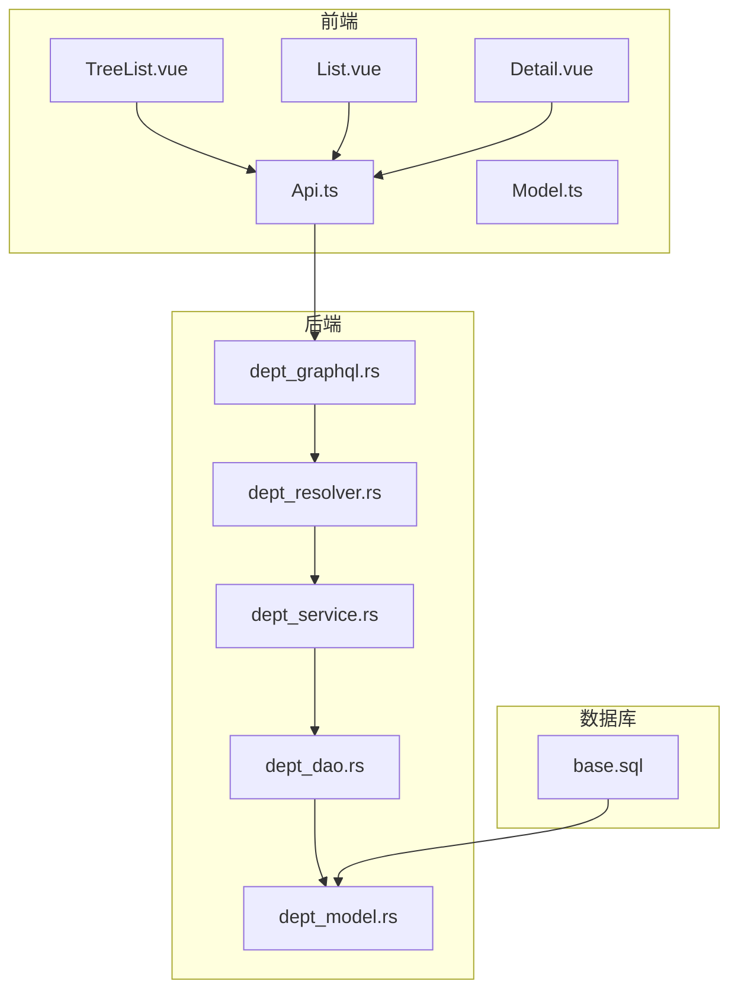
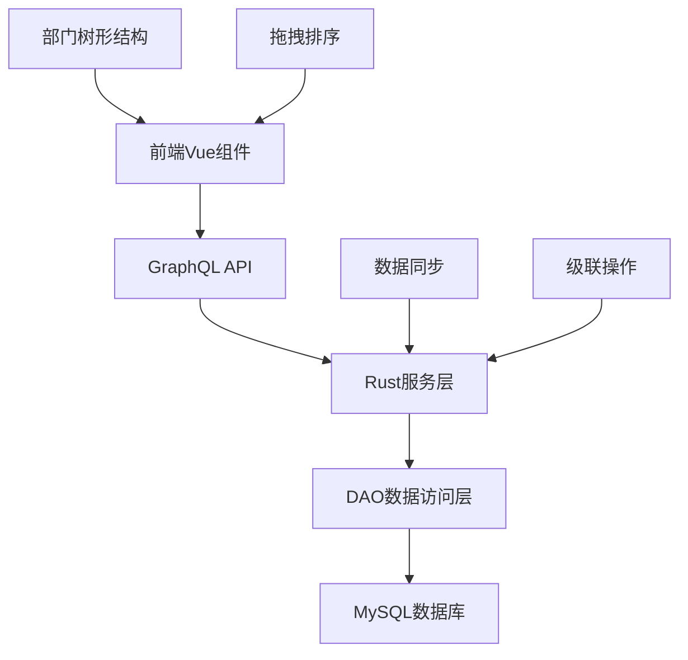
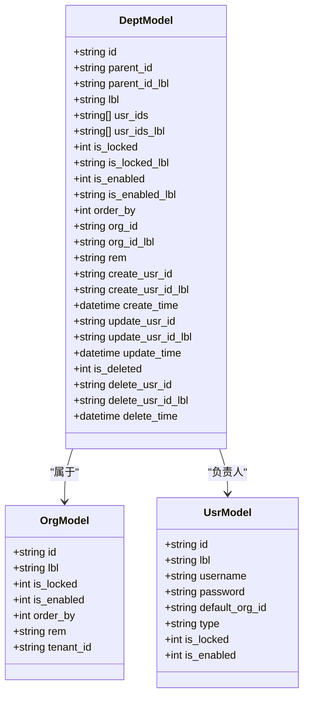
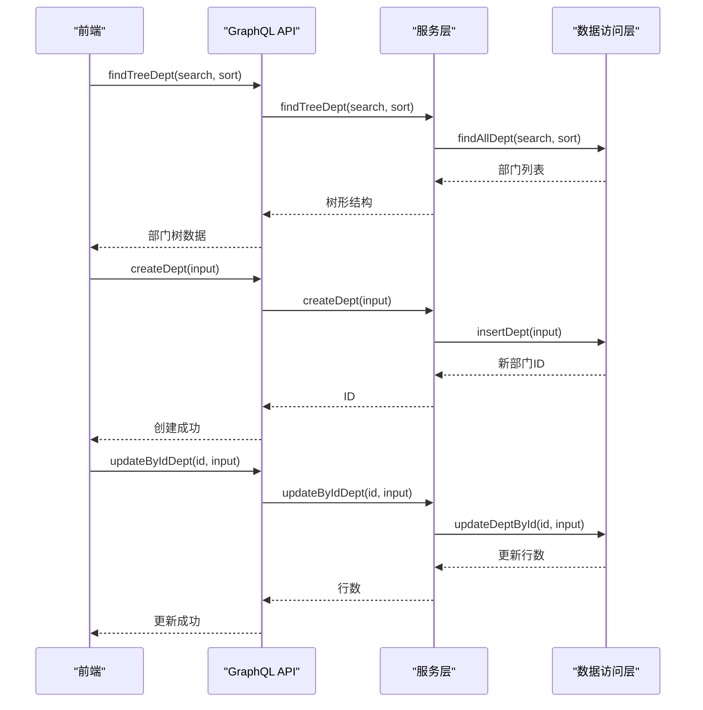
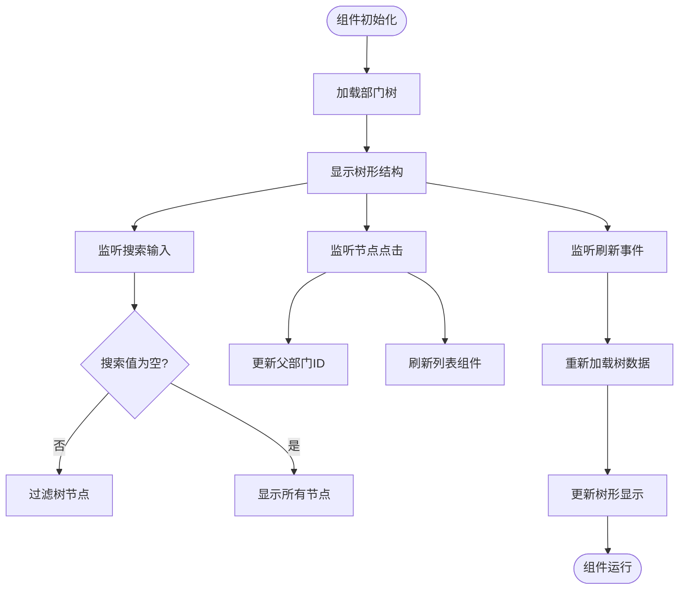
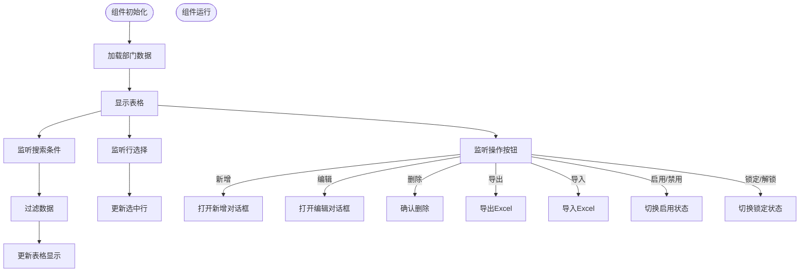
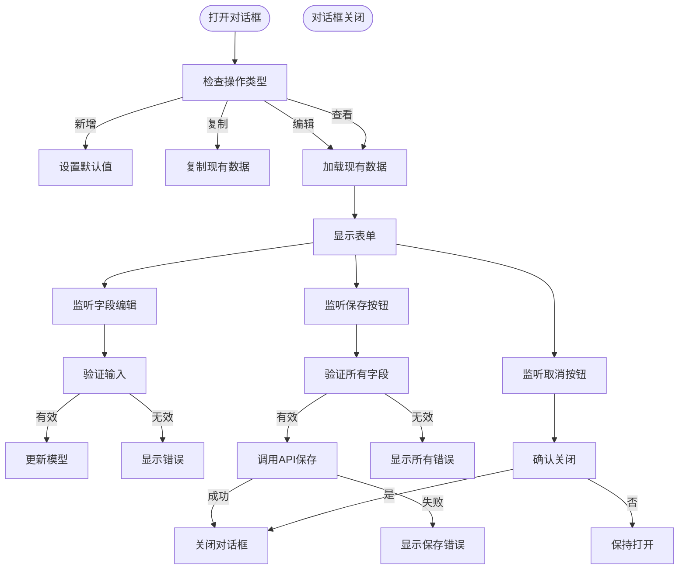
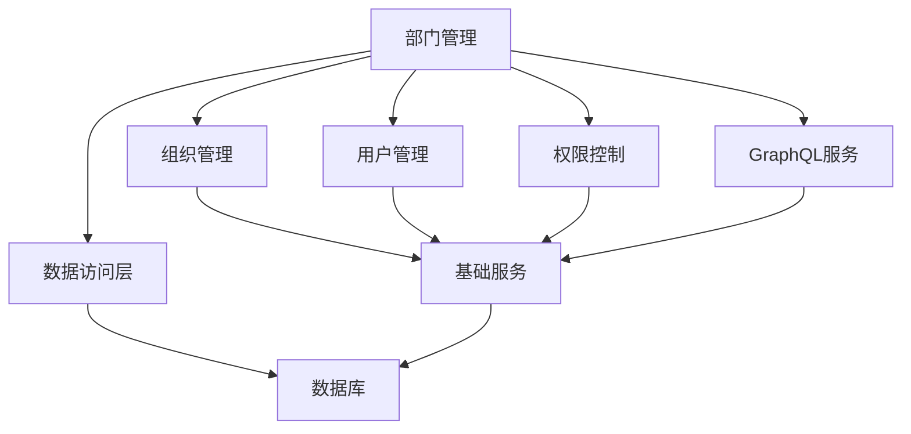

# 部门管理

**本文档引用的文件**  
- [base.sql](https://github.com/sail-sail/nest/blob/main/codegen/src/tables/base/base.sql)
- [Api.ts](https://github.com/sail-sail/nest/blob/main/pc/src/views/base/dept/Api.ts)
- [Model.ts](https://github.com/sail-sail/nest/blob/main/pc/src/views/base/dept/Model.ts)
- [TreeList.vue](https://github.com/sail-sail/nest/blob/main/pc/src/views/base/dept/TreeList.vue)
- [List.vue](https://github.com/sail-sail/nest/blob/main/pc/src/views/base/dept/List.vue)
- [Detail.vue](https://github.com/sail-sail/nest/blob/main/pc/src/views/base/dept/Detail.vue)
- [dept_model.rs](https://github.com/sail-sail/nest/blob/main/rust/generated/base/dept/dept_model.rs)
- [dept_graphql.rs](https://github.com/sail-sail/nest/blob/main/rust/generated/base/dept/dept_graphql.rs)
- [dept_service.rs](https://github.com/sail-sail/nest/blob/main/rust/generated/base/dept/dept_service.rs)

## 目录
1. [简介](#简介)
2. [项目结构](#项目结构)
3. [核心组件](#核心组件)
4. [架构概述](#架构概述)
5. [详细组件分析](#详细组件分析)
6. [依赖分析](#依赖分析)
7. [性能考虑](#性能考虑)
8. [故障排除指南](#故障排除指南)
9. [结论](#结论)

## 简介
本文档详细介绍了部门管理功能的设计与实现，重点阐述了部门实体的数据模型、树形结构管理机制、GraphQL接口支持以及前端组件的交互实现。文档涵盖了部门与组织的关联关系、数据同步、级联操作和性能优化等关键方面，为开发人员和系统维护者提供全面的技术参考。

## 项目结构
部门管理功能的代码分布在多个目录中，主要包括前端Vue组件、GraphQL API定义、Rust后端服务和数据库模型。前端代码位于`pc/src/views/base/dept`目录，后端服务位于`rust/generated/base/dept`目录，数据库定义位于`codegen/src/tables/base/base.sql`。

**图示来源**
- [TreeList.vue](https://github.com/sail-sail/nest/blob/main/pc/src/views/base/dept/TreeList.vue)
- [List.vue](https://github.com/sail-sail/nest/blob/main/pc/src/views/base/dept/List.vue)
- [Detail.vue](https://github.com/sail-sail/nest/blob/main/pc/src/views/base/dept/Detail.vue)
- [Api.ts](https://github.com/sail-sail/nest/blob/main/pc/src/views/base/dept/Api.ts)
- [dept_graphql.rs](https://github.com/sail-sail/nest/blob/main/rust/generated/base/dept/dept_graphql.rs)
- [dept_service.rs](https://github.com/sail-sail/nest/blob/main/rust/generated/base/dept/dept_service.rs)
- [base.sql](https://github.com/sail-sail/nest/blob/main/codegen/src/tables/base/base.sql)

**本节来源**
- [base.sql](https://github.com/sail-sail/nest/blob/main/codegen/src/tables/base/base.sql)
- [Api.ts](https://github.com/sail-sail/nest/blob/main/pc/src/views/base/dept/Api.ts)
- [TreeList.vue](https://github.com/sail-sail/nest/blob/main/pc/src/views/base/dept/TreeList.vue)

## 核心组件
部门管理功能的核心组件包括部门实体模型、GraphQL API接口、前端展示组件和树形结构管理。这些组件共同实现了部门的增删改查、树形结构展示和拖拽排序等功能。

**本节来源**
- [base.sql](https://github.com/sail-sail/nest/blob/main/codegen/src/tables/base/base.sql)
- [dept_model.rs](https://github.com/sail-sail/nest/blob/main/rust/generated/base/dept/dept_model.rs)
- [Api.ts](https://github.com/sail-sail/nest/blob/main/pc/src/views/base/dept/Api.ts)
- [TreeList.vue](https://github.com/sail-sail/nest/blob/main/pc/src/views/base/dept/TreeList.vue)

## 架构概述
部门管理功能采用前后端分离架构，前端使用Vue框架，后端使用Rust实现GraphQL服务。数据存储在MySQL数据库中，通过DAO层进行访问。GraphQL接口提供了丰富的查询和修改操作，支持部门的树形结构查询和批量操作。

**图示来源**
- [Api.ts](https://github.com/sail-sail/nest/blob/main/pc/src/views/base/dept/Api.ts)
- [dept_graphql.rs](https://github.com/sail-sail/nest/blob/main/rust/generated/base/dept/dept_graphql.rs)
- [dept_service.rs](https://github.com/sail-sail/nest/blob/main/rust/generated/base/dept/dept_service.rs)
- [dept_dao.rs](https://github.com/sail-sail/nest/blob/main/rust/generated/base/dept/dept_dao.rs)
- [base.sql](https://github.com/sail-sail/nest/blob/main/codegen/src/tables/base/base.sql)

## 详细组件分析

### 部门实体模型分析
部门实体模型定义了部门的核心属性和关系，包括部门编码、名称、负责人、联系电话、父部门ID等关键字段。模型还包含了与组织的关联关系，支持多租户环境下的部门管理。

**图示来源**
- [base.sql](https://github.com/sail-sail/nest/blob/main/codegen/src/tables/base/base.sql)
- [dept_model.rs](https://github.com/sail-sail/nest/blob/main/rust/generated/base/dept/dept_model.rs)
- [Model.ts](https://github.com/sail-sail/nest/blob/main/pc/src/views/base/dept/Model.ts)

**本节来源**
- [base.sql](https://github.com/sail-sail/nest/blob/main/codegen/src/tables/base/base.sql)
- [dept_model.rs](https://github.com/sail-sail/nest/blob/main/rust/generated/base/dept/dept_model.rs)
- [Model.ts](https://github.com/sail-sail/nest/blob/main/pc/src/views/base/dept/Model.ts)

### GraphQL接口分析
GraphQL接口提供了完整的部门管理功能，包括增删改查、树形结构查询和批量操作。接口设计遵循RESTful原则，支持灵活的查询条件和排序规则。

**图示来源**
- [Api.ts](https://github.com/sail-sail/nest/blob/main/pc/src/views/base/dept/Api.ts)
- [dept_graphql.rs](https://github.com/sail-sail/nest/blob/main/rust/generated/base/dept/dept_graphql.rs)
- [dept_service.rs](https://github.com/sail-sail/nest/blob/main/rust/generated/base/dept/dept_service.rs)
- [dept_dao.rs](https://github.com/sail-sail/nest/blob/main/rust/generated/base/dept/dept_dao.rs)

**本节来源**
- [Api.ts](https://github.com/sail-sail/nest/blob/main/pc/src/views/base/dept/Api.ts)
- [dept_graphql.rs](https://github.com/sail-sail/nest/blob/main/rust/generated/base/dept/dept_graphql.rs)
- [dept_service.rs](https://github.com/sail-sail/nest/blob/main/rust/generated/base/dept/dept_service.rs)

### 前端组件分析
前端组件实现了部门管理的用户界面，包括树形列表、表格列表和详情编辑。组件之间通过事件和属性进行通信，提供了流畅的用户体验。

#### TreeList.vue组件分析
TreeList.vue组件实现了部门树的可视化展示和交互操作，支持搜索过滤、节点点击和树形刷新。

**图示来源**
- [TreeList.vue](https://github.com/sail-sail/nest/blob/main/pc/src/views/base/dept/TreeList.vue)
- [Api.ts](https://github.com/sail-sail/nest/blob/main/pc/src/views/base/dept/Api.ts)

**本节来源**
- [TreeList.vue](https://github.com/sail-sail/nest/blob/main/pc/src/views/base/dept/TreeList.vue)
- [Api.ts](https://github.com/sail-sail/nest/blob/main/pc/src/views/base/dept/Api.ts)

#### List.vue组件分析
List.vue组件处理部门列表的展示和批量操作，支持分页、排序、选择和多种操作按钮。

**图示来源**
- [List.vue](https://github.com/sail-sail/nest/blob/main/pc/src/views/base/dept/List.vue)
- [Api.ts](https://github.com/sail-sail/nest/blob/main/pc/src/views/base/dept/Api.ts)

**本节来源**
- [List.vue](https://github.com/sail-sail/nest/blob/main/pc/src/views/base/dept/List.vue)
- [Api.ts](https://github.com/sail-sail/nest/blob/main/pc/src/views/base/dept/Api.ts)

#### Detail.vue组件分析
Detail.vue组件处理部门详情的展示和编辑，支持新增、复制、编辑和查看模式。

**图示来源**
- [Detail.vue](https://github.com/sail-sail/nest/blob/main/pc/src/views/base/dept/Detail.vue)
- [Api.ts](https://github.com/sail-sail/nest/blob/main/pc/src/views/base/dept/Api.ts)

**本节来源**
- [Detail.vue](https://github.com/sail-sail/nest/blob/main/pc/src/views/base/dept/Detail.vue)
- [Api.ts](https://github.com/sail-sail/nest/blob/main/pc/src/views/base/dept/Api.ts)

## 依赖分析
部门管理功能依赖于多个核心模块，包括组织管理、用户管理、权限控制和数据访问层。这些依赖关系确保了部门功能的完整性和一致性。

**图示来源**
- [base.sql](https://github.com/sail-sail/nest/blob/main/codegen/src/tables/base/base.sql)
- [dept_service.rs](https://github.com/sail-sail/nest/blob/main/rust/generated/base/dept/dept_service.rs)
- [Api.ts](https://github.com/sail-sail/nest/blob/main/pc/src/views/base/dept/Api.ts)

**本节来源**
- [base.sql](https://github.com/sail-sail/nest/blob/main/codegen/src/tables/base/base.sql)
- [dept_service.rs](https://github.com/sail-sail/nest/blob/main/rust/generated/base/dept/dept_service.rs)
- [Api.ts](https://github.com/sail-sail/nest/blob/main/pc/src/views/base/dept/Api.ts)

## 性能考虑
部门管理功能在设计时考虑了多项性能优化措施，包括数据缓存、批量操作和懒加载。这些优化确保了在大数据量下的响应速度和用户体验。

**本节来源**
- [Api.ts](https://github.com/sail-sail/nest/blob/main/pc/src/views/base/dept/Api.ts)
- [dept_service.rs](https://github.com/sail-sail/nest/blob/main/rust/generated/base/dept/dept_service.rs)
- [dept_dao.rs](https://github.com/sail-sail/nest/blob/main/rust/generated/base/dept/dept_dao.rs)

## 故障排除指南
本节提供部门管理功能的常见问题和解决方案，帮助开发人员快速定位和解决问题。

**本节来源**
- [Api.ts](https://github.com/sail-sail/nest/blob/main/pc/src/views/base/dept/Api.ts)
- [dept_service.rs](https://github.com/sail-sail/nest/blob/main/rust/generated/base/dept/dept_service.rs)
- [dept_dao.rs](https://github.com/sail-sail/nest/blob/main/rust/generated/base/dept/dept_dao.rs)

## 结论
部门管理功能通过精心设计的数据模型、高效的GraphQL接口和直观的前端组件，实现了完整的部门管理需求。系统支持树形结构、拖拽排序和批量操作，满足了企业级应用的复杂需求。通过合理的架构设计和性能优化，系统能够稳定高效地处理大量部门数据。