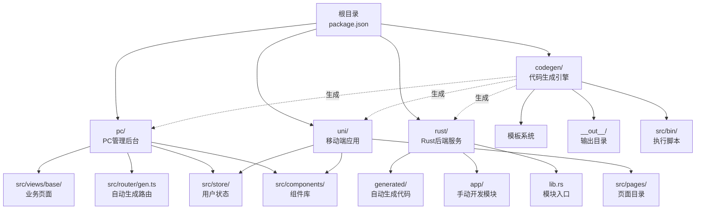
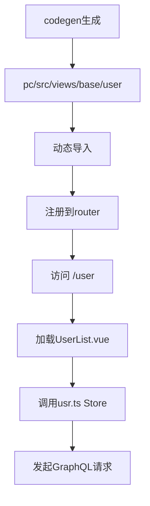
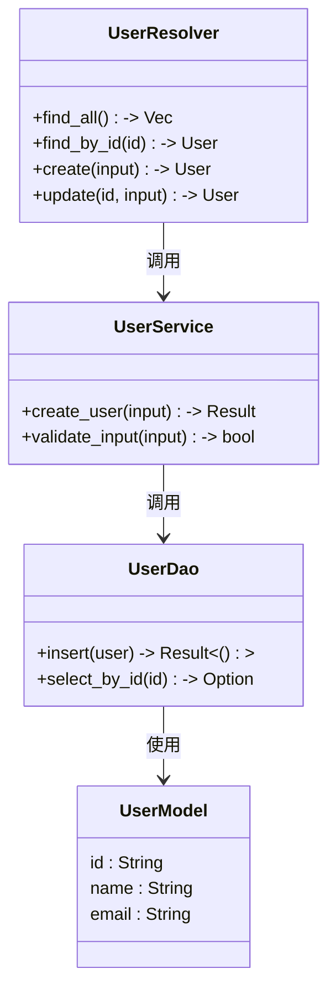
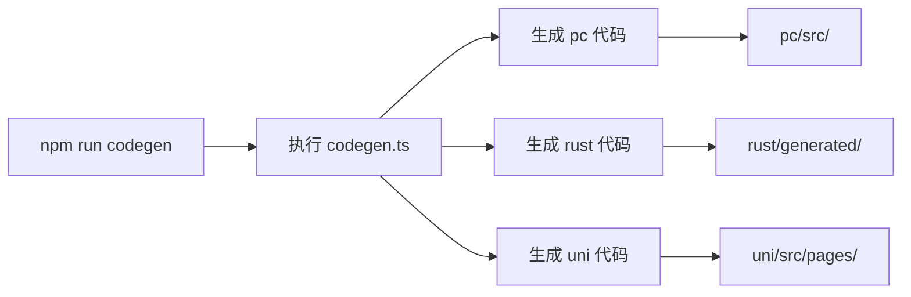

# 目录结构详解

**本文档引用的文件**  
- [package.json](https://github.com/sail-sail/nest/blob/main/package.json)
- [codegen/src/config.ts](https://github.com/sail-sail/nest/blob/main/codegen/src/config.ts)
- [codegen/src/bin/codegen.ts](https://github.com/sail-sail/nest/blob/main/codegen/src/bin/codegen.ts)
- [codegen/template/pc\src/router/gen.ts](https://github.com/sail-sail/nest/blob/main/codegen/template/pc\src/router/gen.ts)
- [codegen/template/rust\generated/lib.rs](https://github.com/sail-sail/nest/blob/main/codegen/template/rust\generated/lib.rs)
- [pc/src/router/gen.ts](https://github.com/sail-sail/nest/blob/main/pc/src/router/gen.ts)
- [pc/src/store/index.ts](https://github.com/sail-sail/nest/blob/main/pc/src/store/index.ts)
- [pc/src/views/base](https://github.com/sail-sail/nest/blob/main/pc/src/views/base)
- [rust/generated/base](https://github.com/sail-sail/nest/blob/main/rust/generated/base)
- [rust/generated/lib.rs](https://github.com/sail-sail/nest/blob/main/rust/generated/lib.rs)
- [rust/app/lib.rs](https://github.com/sail-sail/nest/blob/main/rust/app/lib.rs)
- [uni/src/pages](https://github.com/sail-sail/nest/blob/main/uni/src/pages)
- [codegen/__out__/pc\src/router/gen.ts](https://github.com/sail-sail/nest/blob/main/codegen/__out__/pc\src/router/gen.ts)
- [codegen/__out__/rust\generated/lib.rs](https://github.com/sail-sail/nest/blob/main/codegen/__out__/rust\generated/lib.rs)

## 目录结构

本项目采用Monorepo架构，通过根目录的`package.json`统一管理多个子项目。整体结构清晰，职责分明，主要包含四个核心模块：`codegen`（代码生成引擎）、`pc`（PC端管理后台）、`rust`（Rust后端服务）和`uni`（移动端应用），以及根目录的统一脚本协调机制。

**Diagram sources**  
- [package.json](https://github.com/sail-sail/nest/blob/main/package.json)
- [codegen/src/config.ts](https://github.com/sail-sail/nest/blob/main/codegen/src/config.ts)
- [pc/src/router/gen.ts](https://github.com/sail-sail/nest/blob/main/pc/src/router/gen.ts)
- [rust/generated/lib.rs](https://github.com/sail-sail/nest/blob/main/rust/generated/lib.rs)

## codegen/ 目录：代码生成引擎核心

`codegen/` 是整个项目的代码生成中枢，基于模板驱动的方式自动生成 `pc`、`rust` 和 `uni` 三个平台的代码，极大提升开发效率并保证一致性。

该目录包含三大核心子目录：
- `src/template/`：存放所有代码生成模板，使用 `[[mod]]` 和 `[[table]]` 等占位符实现动态填充。
- `__out__/`：代码生成的输出目录，模拟目标结构，生成内容将被复制到对应项目中。
- `src/bin/`：包含 `codegen.ts` 等可执行脚本，负责解析模板、填充数据并写入目标文件。

生成过程由 `npm run codegen` 触发，读取数据库结构或配置文件，遍历模板目录，替换占位符后输出到 `__out__`，再同步至各子项目。

**Section sources**  
- [codegen/src/bin/codegen.ts](https://github.com/sail-sail/nest/blob/main/codegen/src/bin/codegen.ts)
- [codegen/src/template](https://github.com/sail-sail/nest/blob/main/codegen/src/template)
- [codegen/__out__](https://github.com/sail-sail/nest/blob/main/codegen/__out__)

### 模板系统与输出机制

模板系统位于 `codegen/src/template/`，按平台组织：
- `pc\src/router/gen.ts`：生成PC端路由注册代码。
- `pc\src/views\[[mod_slash_table]]`：为每个数据表生成对应的Vue页面模板。
- `rust\generated\[[mod]]`：为每个模块生成Rust的DAO、Model、Service等完整CRUD结构。
- `uni\src\pages\[[table]]`：生成移动端页面及API定义。

输出机制通过 `__out__` 目录映射生成结果。例如，`__out__/pc\src\views\base\user` 对应用户管理页面，`__out__/rust\generated\base\user` 对应Rust侧的用户服务代码。生成后可通过脚本自动同步至 `pc/src/` 和 `rust/generated/`。

**Section sources**  
- [codegen/src/template/pc\src/router/gen.ts](https://github.com/sail-sail/nest/blob/main/codegen/src/template/pc\src/router/gen.ts)
- [codegen/src/template/rust\generated\[[mod]]](https://github.com/sail-sail/nest/blob/main/codegen/src/template/rust\generated\[[mod]])
- [codegen/__out__/pc\src/router/gen.ts](https://github.com/sail-sail/nest/blob/main/codegen/__out__/pc\src/router/gen.ts)
- [codegen/__out__/rust\generated/lib.rs](https://github.com/sail-sail/nest/blob/main/codegen/__out__/rust\generated/lib.rs)

## pc/ 目录：PC端管理后台

`pc/` 是基于Vue的PC管理后台，采用模块化设计，所有基础管理功能页面均通过代码生成。

### 组件与页面结构

`src/components/` 存放通用UI组件，如 `CustomInput.vue`、`DictSelect.vue` 等，支持表单、选择器、日期等常用控件。`src/views/base/` 下的每个子目录（如 `user`、`dept`、`menu`）对应一个业务实体，包含列表、编辑、详情等页面，均由 `codegen` 生成。

### 路由与状态管理

路由由 `src/router/gen.ts` 自动注册，所有 `views/base/` 下的页面在构建时被动态导入并注册为路由。状态管理采用Vuex，`src/store/` 下每个模块（如 `usr.ts`、`menu.ts`）管理对应实体的状态，包括数据缓存、权限字段等。

**Diagram sources**  
- [pc/src/router/gen.ts](https://github.com/sail-sail/nest/blob/main/pc/src/router/gen.ts)
- [pc/src/store/usr.ts](https://github.com/sail-sail/nest/blob/main/pc/src/store/usr.ts)
- [pc/src/views/base](https://github.com/sail-sail/nest/blob/main/pc/src/views/base)

**Section sources**  
- [pc/src/router/gen.ts](https://github.com/sail-sail/nest/blob/main/pc/src/router/gen.ts)
- [pc/src/store/index.ts](https://github.com/sail-sail/nest/blob/main/pc/src/store/index.ts)
- [pc/src/views/base](https://github.com/sail-sail/nest/blob/main/pc/src/views/base)

## rust/ 目录：Rust后端服务

`rust/` 是基于Rust的高性能后端服务，采用模块化分层架构，分为 `generated/`（自动生成）和 `app/`（手动开发）两部分。

### 模块化设计

`generated/` 目录存放所有自动生成的代码，每个业务模块（如 `user`、`dept`）包含：
- `*_model.rs`：数据结构定义
- `*_dao.rs`：数据库访问层
- `*_service.rs`：业务逻辑层
- `*_resolver.rs`：GraphQL解析器
- `mod.rs`：模块导出

`app/` 目录存放手动开发的通用功能，如认证、缓存、健康检查等，通过 `lib.rs` 导出供主程序使用。

### generated/ 自动生成代码结构

`generated/base/` 下的每个模块均由 `codegen` 生成，遵循统一的MVC模式。`generated/lib.rs` 作为入口文件，将所有模块聚合并导出，供 `main.rs` 引用。生成的代码与 `pc` 前端保持命名和接口一致性，确保全栈协同。

**Diagram sources**  
- [rust/generated/base/usr/usr_resolver.rs](https://github.com/sail-sail/nest/blob/main/rust/generated/base/usr/usr_resolver.rs)
- [rust/generated/base/usr/usr_service.rs](https://github.com/sail-sail/nest/blob/main/rust/generated/base/usr/usr_service.rs)
- [rust/generated/base/usr/usr_dao.rs](https://github.com/sail-sail/nest/blob/main/rust/generated/base/usr/usr_dao.rs)
- [rust/generated/base/usr/usr_model.rs](https://github.com/sail-sail/nest/blob/main/rust/generated/base/usr/usr_model.rs)

**Section sources**  
- [rust/generated/base](https://github.com/sail-sail/nest/blob/main/rust/generated/base)
- [rust/generated/lib.rs](https://github.com/sail-sail/nest/blob/main/rust/generated/lib.rs)
- [rust/app/lib.rs](https://github.com/sail-sail/nest/blob/main/rust/app/lib.rs)

## uni/ 目录：移动端应用架构

`uni/` 是基于uni-app的跨平台移动应用，结构清晰，页面与组件分离。

`src/pages/` 为页面入口，每个页面目录（如 `optbiz`）包含 `.vue` 页面文件和 `Api.ts` 接口定义。`src/components/` 提供移动端专用组件，如 `CustomInputModal.vue`、`DictbizSelect.vue` 等，适配触摸交互。状态管理通过 `src/store/` 实现，`usr.ts` 管理用户登录态和权限信息。

所有业务页面（如用户管理、组织架构）均可由 `codegen` 生成，确保与PC端功能对齐。

**Section sources**  
- [uni/src/pages](https://github.com/sail-sail/nest/blob/main/uni/src/pages)
- [uni/src/components](https://github.com/sail-sail/nest/blob/main/uni/src/components)
- [uni/src/store/usr.ts](https://github.com/sail-sail/nest/blob/main/uni/src/store/usr.ts)

## 根目录 package.json：Monorepo 统一协调

根目录的 `package.json` 是整个Monorepo的控制中心，通过 `scripts` 字段定义统一命令：

- `npm run codegen`：执行代码生成，调用 `codegen/src/bin/codegen.ts`
- `npm run build:pc`：构建PC端应用
- `npm run serve:rust`：启动Rust后端
- `npm run build:uni`：构建移动端应用

这些脚本协调各子项目的依赖和执行流程，开发者只需在根目录运行命令，即可完成全栈构建与部署，极大简化了多项目管理复杂度。

**Diagram sources**  
- [package.json](https://github.com/sail-sail/nest/blob/main/package.json)
- [codegen/src/bin/codegen.ts](https://github.com/sail-sail/nest/blob/main/codegen/src/bin/codegen.ts)

**Section sources**  
- [package.json](https://github.com/sail-sail/nest/blob/main/package.json)

## 新开发者导航地图

对于新加入项目的开发者，建议按以下路径快速上手：

1. **了解整体结构**：查看本目录结构文档，理解 `codegen`、`pc`、`rust`、`uni` 四大模块关系。
2. **运行代码生成**：执行 `npm run codegen`，观察 `__out__` 输出，理解模板如何生成代码。
3. **定位功能模块**：
   - 前端页面 → `pc/src/views/base/[模块]`
   - 后端接口 → `rust/generated/[模块]/*.rs`
   - 移动端页面 → `uni/src/pages/[模块]`
4. **修改与扩展**：
   - 通用功能修改 → `app/` 或 `pc/src/components/`
   - 新增业务模块 → 修改 `codegen` 模板并重新生成
5. **调试与构建**：使用根目录脚本统一构建和启动各服务。

通过此导航地图，开发者可快速定位关键功能，高效参与项目开发。