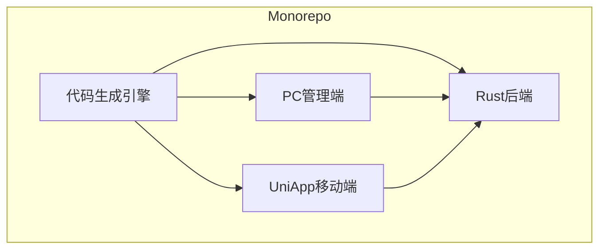
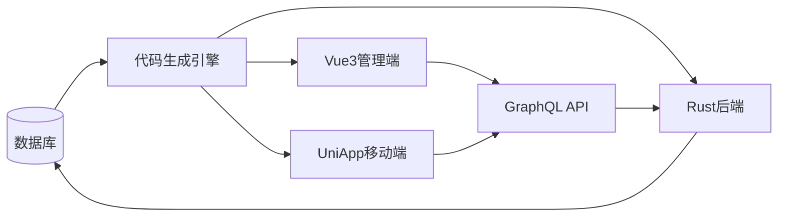
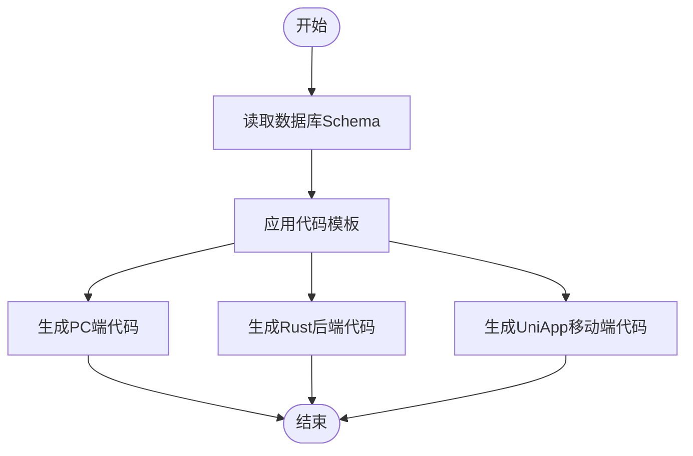
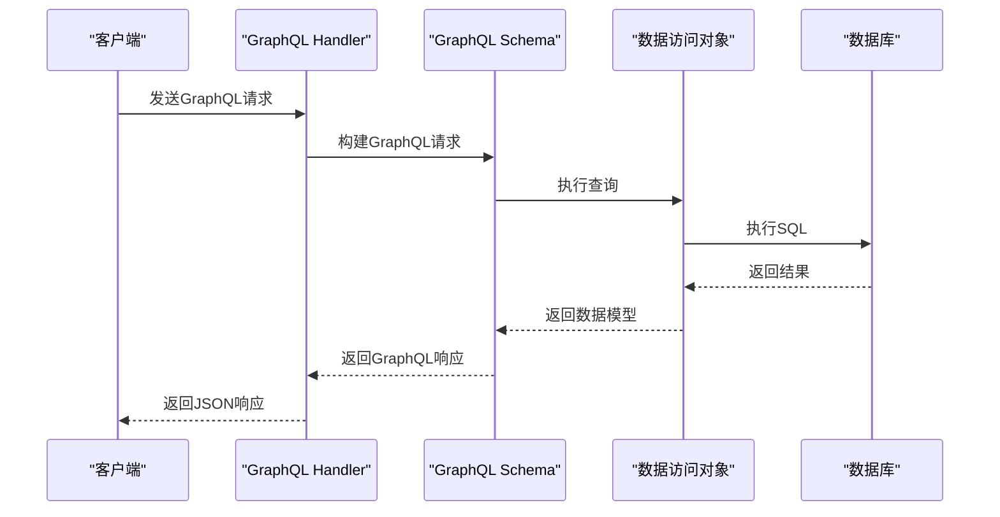
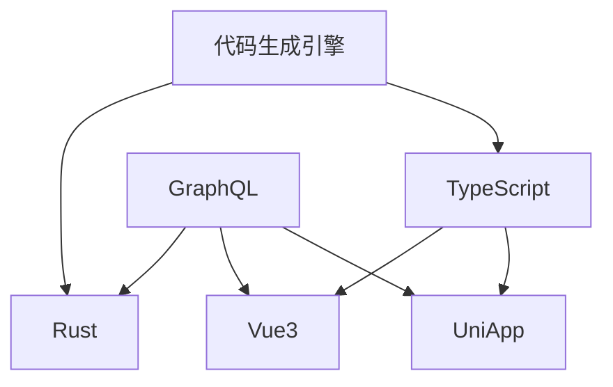

# 系统概述

**本文档中引用的文件**  
- [codegen.ts](https://github.com/sail-sail/nest/blob/main/codegen/src/bin/codegen.ts)
- [main.rs](https://github.com/sail-sail/nest/blob/main/rust/main.rs)
- [schema.rs](https://github.com/sail-sail/nest/blob/main/rust/schema.rs)
- [main.ts](https://github.com/sail-sail/nest/blob/main/pc/src/main.ts)
- [main.ts](https://github.com/sail-sail/nest/blob/main/uni/src/main.ts)
- [config.ts](https://github.com/sail-sail/nest/blob/main/codegen/src/config.ts)
- [graphql_codegen_config.ts](https://github.com/sail-sail/nest/blob/main/rust/generated/common/script/graphql_codegen_config.ts)
- [graphql.config.js](https://github.com/sail-sail/nest/blob/main/pc/graphql.config.js)
- [graphql.config.js](https://github.com/sail-sail/nest/blob/main/uni/graphql.config.js)
- [codegen.config.ts](https://github.com/sail-sail/nest/blob/main/codegen/src/config.ts)

## 目录
1. [核心价值与架构定位](#核心价值与架构定位)
2. [项目结构](#项目结构)
3. [核心组件](#核心组件)
4. [架构概览](#架构概览)
5. [详细组件分析](#详细组件分析)
6. [依赖分析](#依赖分析)
7. [性能考量](#性能考量)
8. [故障排除指南](#故障排除指南)
9. [结论](#结论)

## 核心价值与架构定位

### 传统开发模式的痛点

1. **可视化低代码平台的局限性**：传统的拖拽式低代码平台虽然降低了入门门槛，但对开发人员而言存在较高的学习成本，且灵活性不足，难以进行深度定制化开发。同时，这些平台往往无法及时集成最新的技术栈和生态工具，限制了技术的演进。

2. **传统代码生成器的缺陷**：传统的代码生成器通过模板生成代码，但一旦手动修改了生成的代码，在下次重新生成时会覆盖之前的修改，导致无法在项目开发过程中持续使用。这种“一次性”特性使得代码生成器仅适用于项目初始化阶段，难以支持快速迭代的需求。

### 本项目的创新解决方案

本项目提出了一种全新的代码生成模式，旨在解决上述两大痛点，实现**代码生成器与手动开发的无缝融合**。其核心思想是：

> **通过代码生成器生成代码，但生成的代码在手动修改后能够被自动识别，并在下次生成时保留这些修改，从而实现增量式代码生成。**

该机制利用 `git diff` 和 `git apply` 技术来精确识别代码的变化，确保自动生成的代码不会覆盖开发人员的手动修改。这种方式不仅保留了代码生成器的高效性，还赋予了开发人员完全的代码控制权，实现了“10倍开发效率”的提升。

**Section sources**  
- [README.md](https://github.com/sail-sail/nest/blob/main/README.md#L1-L32)

## 项目结构
nest 项目采用 Monorepo 结构，包含 codegen、pc、rust 和 uni 四个主要子项目。codegen 负责代码生成，pc 是 Vue3 管理端，rust 是后端服务，uni 是 UniApp 移动端。

**Diagram sources**
- [project_structure](https://github.com/sail-sail/nest/blob/main/project_structure)

## 核心组件
nest 的核心组件包括代码生成引擎、Vue3 管理端、Rust 后端和 UniApp 移动端。代码生成引擎根据数据库表结构生成前后端代码，Vue3 管理端使用 Element Plus 构建用户界面，Rust 后端提供高性能 API 服务，UniApp 移动端实现跨平台移动应用。

**Section sources**
- [codegen.ts](https://github.com/sail-sail/nest/blob/main/codegen/src/bin/codegen.ts#L62-L123)
- [main.ts](https://github.com/sail-sail/nest/blob/main/pc/src/main.ts#L0-L37)
- [main.ts](https://github.com/sail-sail/nest/blob/main/uni/src/main.ts#L0-L28)
- [main.rs](https://github.com/sail-sail/nest/blob/main/rust/main.rs#L0-L485)

## 架构概览
nest 的整体架构以 GraphQL 为中心，连接前端和后端。代码生成引擎根据数据库表结构生成前后端代码，前端通过 GraphQL 查询后端数据，后端通过 Rust 实现高性能数据处理。

**Diagram sources**
- [main.rs](https://github.com/sail-sail/nest/blob/main/rust/main.rs#L298-L353)
- [schema.rs](https://github.com/sail-sail/nest/blob/main/rust/schema.rs#L0-L35)

## 详细组件分析

### 代码生成引擎分析
代码生成引擎是 nest 的核心，负责根据数据库表结构生成前后端代码。它读取数据库 schema，应用模板生成 Vue3、Rust 和 UniApp 代码。

#### 代码生成流程

**Diagram sources**
- [codegen.ts](https://github.com/sail-sail/nest/blob/main/codegen/src/bin/codegen.ts#L62-L123)
- [config.ts](https://github.com/sail-sail/nest/blob/main/codegen/src/config.ts#L0-L799)

### 后端服务分析
Rust 后端服务使用 async-graphql 和 poem 框架实现 GraphQL API，提供高性能、类型安全的后端服务。

#### GraphQL 请求处理流程

**Diagram sources**
- [main.rs](https://github.com/sail-sail/nest/blob/main/rust/main.rs#L95-L122)
- [schema.rs](https://github.com/sail-sail/nest/blob/main/rust/schema.rs#L0-L35)

## 依赖分析
nest 项目依赖多种技术栈，包括 Rust、TypeScript、Vue3、UniApp 和 GraphQL。这些技术栈通过代码生成引擎紧密集成，形成统一的全栈开发框架。

**Diagram sources**
- [package.json](https://github.com/sail-sail/nest/blob/main/pc/package.json)
- [Cargo.toml](https://github.com/sail-sail/nest/blob/main/rust/Cargo.toml)
- [package.json](https://github.com/sail-sail/nest/blob/main/uni/package.json)

## 性能考量
nest 选择 Rust 作为后端语言，主要基于其高性能、内存安全和并发处理能力。Rust 的零成本抽象和无垃圾回收机制使其非常适合构建高性能后端服务。GraphQL 的使用减少了网络传输数据量，提高了 API 效率。

## 故障排除指南
当遇到代码生成失败时，检查数据库连接和表结构定义。当 GraphQL API 返回错误时，检查请求格式和认证信息。当前端无法连接后端时，检查网络配置和 CORS 设置。

**Section sources**
- [main.rs](https://github.com/sail-sail/nest/blob/main/rust/main.rs#L95-L122)
- [main.ts](https://github.com/sail-sail/nest/blob/main/pc/src/main.ts#L0-L37)

## 结论
nest 作为一个全栈低代码开发框架，通过 Monorepo 结构和代码生成引擎，实现了前后端代码的自动化生成。其采用 Vue3 + Element Plus 管理端、UniApp 移动端和 Rust 高性能后端的技术整合方式，结合 GraphQL 作为统一 API 接口，为开发者提供了高效、可靠的开发体验。选择 Rust 作为后端语言体现了对性能和安全的高度重视，而 TypeScript 在全栈中的统一应用则保证了代码的一致性和可维护性。