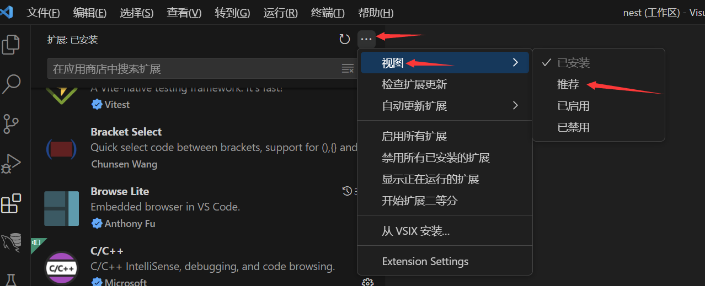
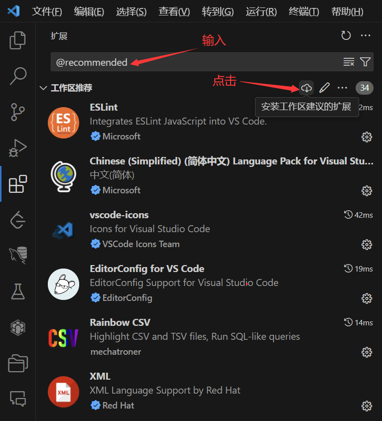

# 安装开发环境
  
  1. 安装vscode
     - https://code.visualstudio.com/
  
  2. 下载deno
     - https://deno.land/
  
  3. git克隆项目
  
  4. 安装nodejs， nodejs的版本需为20
     - https://nodejs.org/en/
  
  5. 安装pnpm:  在cmd下执行 `npm i -g pnpm`
  
  6. cmd 进入工程所在目录， 在最外层文件夹和 `pc` `deno` `codegen` `uni` 目录下分别执行： `pnpm i` 来安装依赖包
     - 其中：`pc` 是电脑端， `deno` 是后端，`uni` 是小程序端， `codegen` 是代码自动生成工具
  ```
  pnpm i 的时候如果报错： pnpm: 无法加载文件 C:\Users\14059\AppData\Roaming\npm\pnpm.ps1，因为在此系统上禁止运行脚本
  
  则说明 pnpm 脚本在 PowerShell 里面没有权限：
    用管理员方式打开 PowerShell 执行: set-ExecutionPolicy RemoteSigned 输入y
    查看设置是否成功: get-ExecutionPolicy
    返回: RemoteSigned
  ```
  
  7. 在vscode选择 `从文件夹打开工作区...` 打开工程所在目录的 `nest.code-workspace` 文件， 安装工程推荐的所有推荐的插件
      - 打开vscode控制台，cd进入pc和deno， 分别执行 npm start 启动后端，电脑端和小程序端
      - 这时候，可能或报错， 因为启动deno的时候， 回去github里面下载三方依赖包，有些github外网的无法下载
  
  8. 配置hosts文件, 加入：`185.199.110.133 raw.githubusercontent.com` 
      - hosts文件在目录： `C:\WINDOWS\system32\drivers\etc` 
      - 需要管理员权限才可以修改hosts文件，注意把hosts文件的只读权限去掉
      - 要用 `nodepad++` 才能编辑, 下载地址： https://notepad-plus-plus.org/downloads/
  
  9. 安装redis，用于缓存数据 (开发环境可以不安装)
  
  10. 安装微信小程序开发者工具 (可选)
      - 进入uni目录， 执行 npm start 之后， 用微信小程序开发者工具打开 【工程目录】\uni\dist\dev\mp-weixin
      - 即为调试微信小程序
  
  11. 安装mysql客户端 `workbench`
      - https://dev.mysql.com/downloads/workbench/6.3.html
      - 到了这个界面： https://dev.mysql.com/downloads/file/?id=514051
      - 时， 注意不需要注册，直接点击下面的 `No thanks, just start my download.` 即可下载
  
  12. （注意）非常重要， 否则一大堆换行符被git认为文件修改了， 其实只是换行符不对， 需要执行：
  
  ```bash
  git config --global core.autocrlf false
  git config --global core.eol lf
  ```
  
  13. deno目录下面的 `.env.dev` 为开发时的配置文件， 数据库配置也在里面
      - `.env.test` 为测试环境的配置文件
      - `.env.prod` 为发布到linux服务器时的配置文件
  
  14. 要安装本项目推荐的vscode插件
        
        
        或者
        
        
  
  15. (可选) 如果全局安装 `npm i -g @antfu/ni`
      - 则: `npm start` 命令可改为 `nr start`
      - `pnpm i` 可改为 `ni`
      - `npm run codegen` 可改为 `nr codegen`